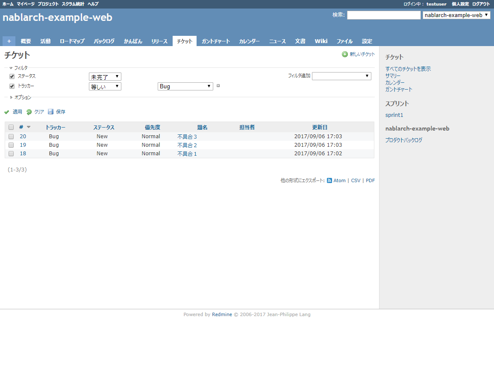

Collaborage
================================

クラウド上にチーム開発環境を素早く作るテンプレートを提供します。
Collaborage(コラボレージ)により、チーム開発環境の初期構築コストを削減します。
さらに、Collaborageを使うPJを増やし、チーム開発環境の学習コストの削減を目指しています。

- Collaborage(コラボレージ)の紹介
  - [Collaborageについて](#collaborageについて)
  - [何ができあがるの？](#何ができあがるの)
  - [何ができるの？](#何ができるの)
  - [グランドデザイン](#グランドデザイン)
  - [ライセンス](#ライセンス)
- インストール/オペレーション
  - [AWS編](doc/aws.md)
- [プロジェクトの開発準備](doc/dev.md)
- [パイプラインの簡単な説明](doc/pipe.md)
- 活用に向けたリファレンス
  - [スプリント運営ガイド](https://fintan.jp/?p=948)
  - [マスタリング ビルド職人](https://uga.gitbooks.io/mastering-builder/content/)

## Collaborageについて

Collaborageは、当初**NoP**(ナップ)というコードネームで開発、リリースされました。
OSS化にあたって、より親しみをもってもらえるよう**Collaborage**という名称に変更しました。
ドキュメントやソースコード中に一部**NoP**という表記が現れますが、
これらについては「Collaborageのことだな」と思ってお読み頂けますようお願い致します。

## 何ができあがるの？

できあがるチーム開発環境です。

できあがる環境での各アプリのバージョンです。

| サーバ | アプリ                          | バージョン　  | 
|:----|:-----------------------------|:--------|
| CQ  | Redmine                      | 4.2.10  | 
|     | Rocket.Chat                  | 5.4.9   | 
|     | SonarQube(Community Edition) | 10.1.0  | 
| CI  | Jenkins                      | 2.401.1 | 
|     | GitBucket                    | 4.38.4  | 
|     | GitLab (Community Edition)   | 16.0.1  | 
|     | Nexus Repository Manager 3   | 3.55.0  | 

## 何ができるの？

できあがるチーム開発環境では、フィードバックを早め、手戻りを小さくし、リードタイムを短くすることを目指しています。

- コミュニケーションのサポート
  - バックログ
    - 
    - 右側がバックログ、左側がスプリントになります。
    - 今回のスプリントで取り組むストーリーをバックログからスプリントに移動させて使います。
    - バックログ/スプリントともに、ストーリーを上下に移動させ、優先度の高いものを上から並べます。
    - 使い方の詳細は[このあたり](https://www.google.co.jp/search?q=Redmine+BackLogs+%E3%82%B9%E3%82%AF%E3%83%A9%E3%83%A0&oq=Redmine+BackLogs+%E3%82%B9%E3%82%AF%E3%83%A9%E3%83%A0&gs_l=psy-ab.3..0i30k1.3639.6315.0.6646.12.12.0.0.0.0.123.1045.9j3.12.0....0...1.1j4.64.psy-ab..3.9.796...0j0i4k1j0i4i30k1j0i8i4i30k1.0.nraK63-fWq8)を参照してください。
  - かんばん
    - 
    - 上記画像がかんばんの画面です。
    - ストーリーごとにタスクを並べます。タスクの状態に合わせてレーンを移動させます。
    - タスクの担当者を選択すると、人ごとにタスクの色が変わるので、誰が何をやっているのかすぐに分かります。
    - 手前にあるのが「バーンダウンチャート」です。スプリントの進み具合が分かります。
    - 毎日、かんばんを更新して、バーンダウンチャートでチームの状況を把握しながら、スプリントを進めます。
    - 使い方の詳細は[このあたり](https://www.google.co.jp/search?q=Redmine+BackLogs+%E3%82%B9%E3%82%AF%E3%83%A9%E3%83%A0&oq=Redmine+BackLogs+%E3%82%B9%E3%82%AF%E3%83%A9%E3%83%A0&gs_l=psy-ab.3..0i30k1.3639.6315.0.6646.12.12.0.0.0.0.123.1045.9j3.12.0....0...1.1j4.64.psy-ab..3.9.796...0j0i4k1j0i4i30k1j0i8i4i30k1.0.nraK63-fWq8)を参照してください。
  - ITS（課題/不具合管理)
    - 
    - 課題や不具合をチケットとして登録できます。
    - ステータスや優先度を使って、課題や不具合の状態を管理します。
  - チャット
    - 
    - ちょっとした相談や質問、読んだ本の感想や学んだことなど、チームの活性化につながりそうなことなら何でも発言します。
    - アイコンなどでリアクションするだけでも、チームの活性化につながります。
    - カテゴリや用途ごとにチャンネルを分けて使います。
    - 1対1の会話だと、話した内容が他の人に伝わりませんが、チャットだと一斉に伝わります。
    - また、「あれ、前に誰かと話していたけど・・・」みたいなことが無くなり、後から検索して読み返すこともできます。
- 品質のサポート
  - コードレビュー
    - GitBucket
      - 
      - プルリクエストを使ってコードレビューします。
      - 何でもかんでもマージされないように、プルリクエストを出して、レビューが通らないとマージされないようにします。
      - プルリクエストについては[このあたり](https://www.google.co.jp/search?q=%E3%83%97%E3%83%AB%E3%83%AA%E3%82%AF%E3%82%A8%E3%82%B9%E3%83%88&oq=%E3%83%97%E3%83%AB%E3%83%AA%E3%82%AF%E3%82%A8%E3%82%B9%E3%83%88&aqs=chrome..69i57j0l5.3380j0j7&sourceid=chrome&ie=UTF-8)を参照してください。
    - GitLab
      - 
      - マージリクエストを使ってコードレビューします。
      - 何でもかんでもマージされないように、マージリクエストを出して、レビューが通らないとマージされないようにします。
      - マージリクエストはプルリクエストと同じ意味になります。ツールによって呼び名が異なります。
      - マージリクエストについてはプルリクエストを調べて頂くと分かりやすいです。[このあたり](https://www.google.co.jp/search?q=%E3%83%97%E3%83%AB%E3%83%AA%E3%82%AF%E3%82%A8%E3%82%B9%E3%83%88&oq=%E3%83%97%E3%83%AB%E3%83%AA%E3%82%AF%E3%82%A8%E3%82%B9%E3%83%88&aqs=chrome..69i57j0l5.3380j0j7&sourceid=chrome&ie=UTF-8)を参照してください。
  - コード解析
    - 
    - テストカバレッジや様々な観点でコードをチェックした結果が確認できます。
    - 活用方法は[マスタリングビルド職人](https://uga.gitbooks.io/mastering-builder/content/)の「サイトリポジトリ内での品質モニタリング」を参考にしてください。
- CIのサポート
  - VCS
    - GitBucket
      - 
    - GitLab
      - 
  - Maven/Dockerリポジトリ
    - 
  - パイプライン
    - CIのサンプルが入っているので、参考にして、すぐに開発を始められます
      - Jenkins
        - 
        - パイプラインの内容が表形式で表示され、色により成功/失敗を一目で確認できます。
        - 表のセルを選択して、実行時のログを確認することができます。
      - GitLab Runner(GitLabのCIコンポーネント)
        - 
        - パイプラインの内容が箱と線で表示され、楕円の箱中のアイコン(画像では✔マーク)により状態を一目で確認できます。
        - 楕円の箱を選択して、実行時のログを確認することができます。
    - CIの結果がチャットに通知され、CI結果にすぐに気づけます
      - 
      - CIの成功/失敗をアイコンで表しています。
      - リンクを選択することで、CIのアプリにすぐに移動できます。
    - CIでデモ環境にデプロイされ、すぐに動作確認できます
      - 
    - パイプラインを定義ファイルに記載して、Jenkinsおじさん(属人化)の発生を防ぎます
      - [Jenkins](src/common/pipeline/jenkins/java17/develop/Jenkinsfile)
      - [GitLab Runner](src/common/pipeline/gitlab/java17/develop/.gitlab-ci.yml)
      - パイプラインのファイルはアプリと同じVCSにpushして管理するので、変更履歴も簡単に確認できます。

## 基本方針

- 敷居を下げる。
  - クラウドや採用するツールの使い方を利用者が熟知していることを前提にしない。
  - 技術要素を増やさず、シンプルなものを使用する。
- 自動化する。
  - クラウドのテンプレート機能やdocker composeを使用する。
- 使い方を明示する。
  - 開発準備
  - ログの確認方法
  - バックアップとリストア

## ライセンス

Collaborageは Apache License 2.0 で提供します。

Apache License 2.0 の詳細については、[LICENSE.txt](LICENSE.txt)を参照してください。

