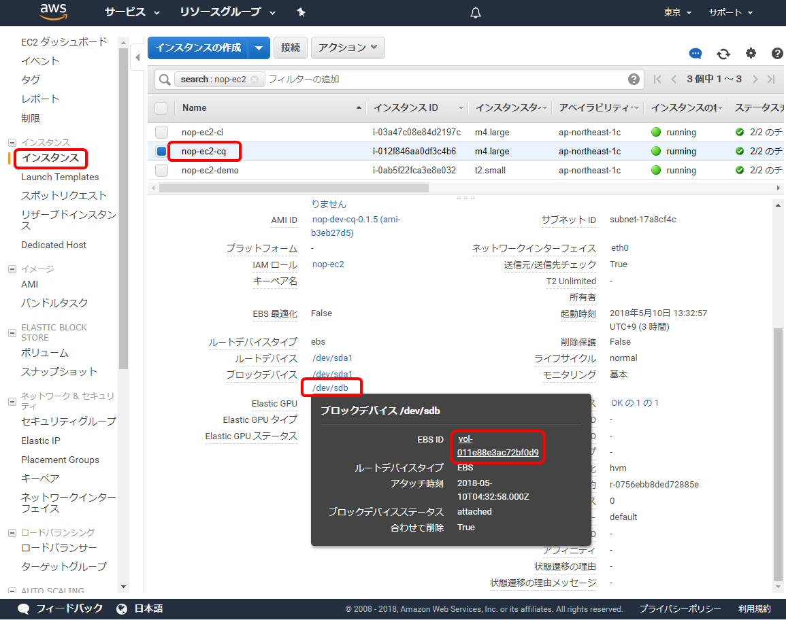
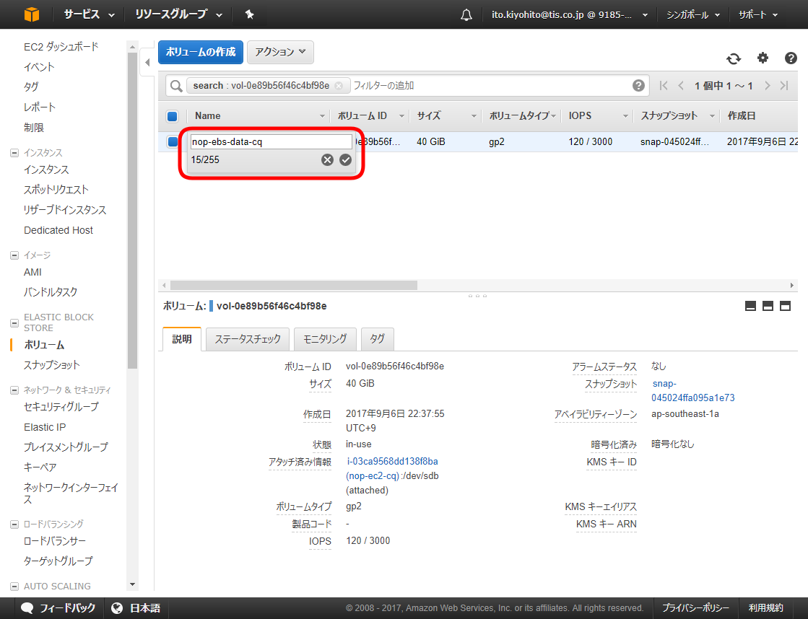
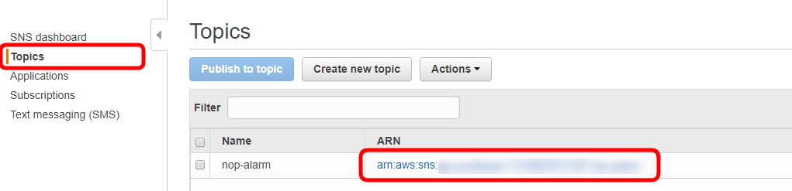
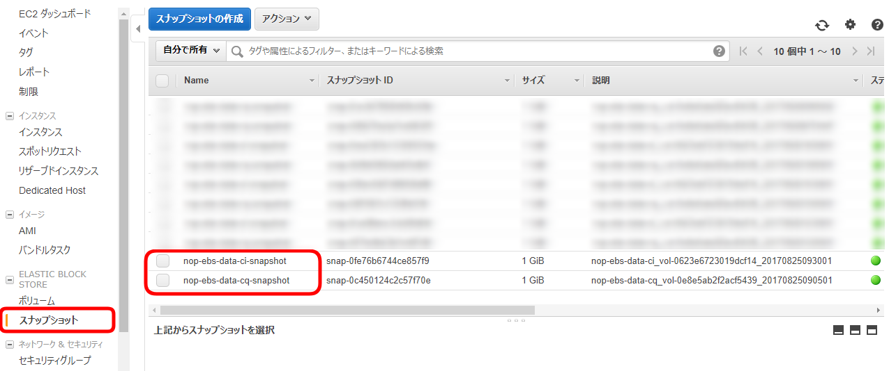
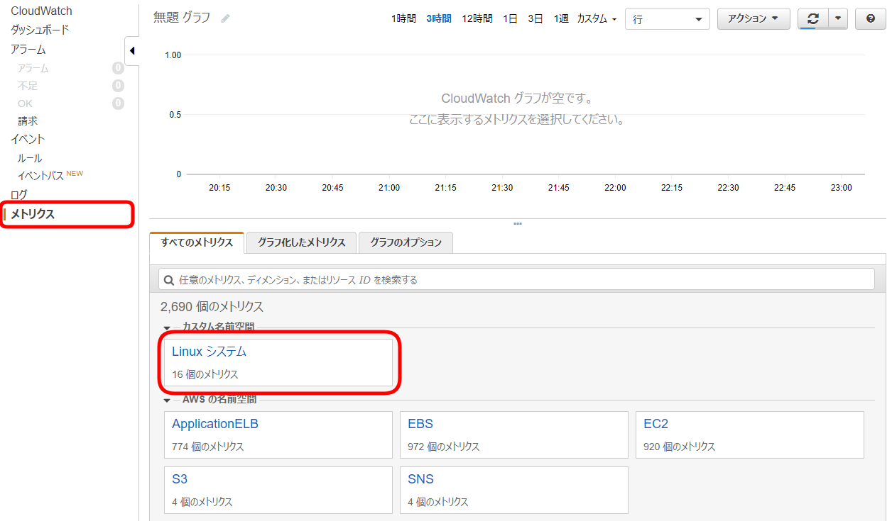
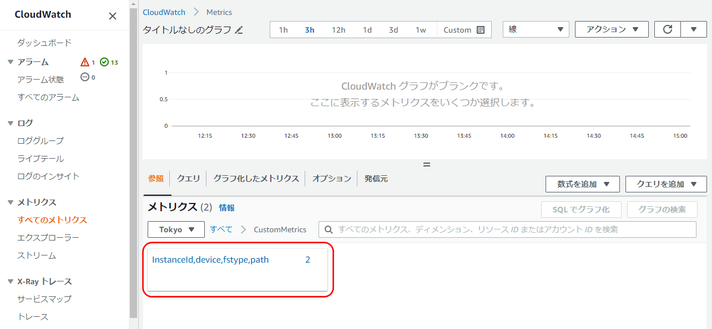
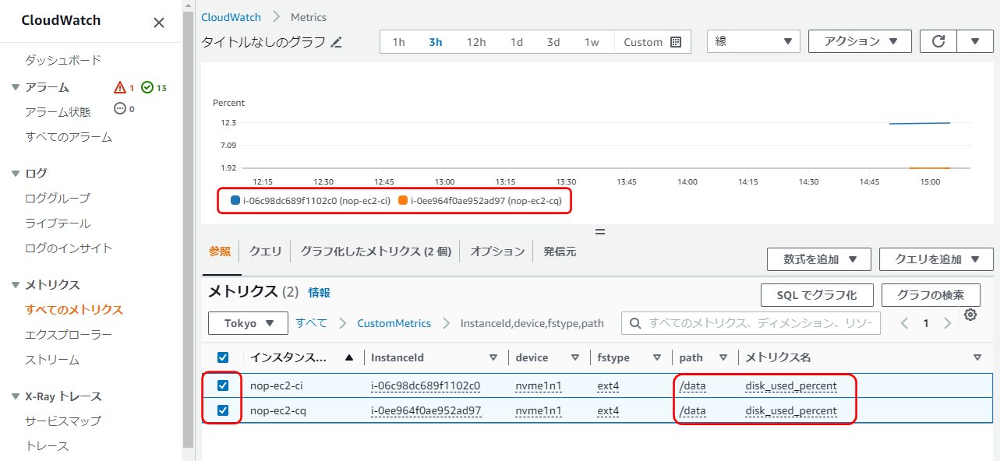
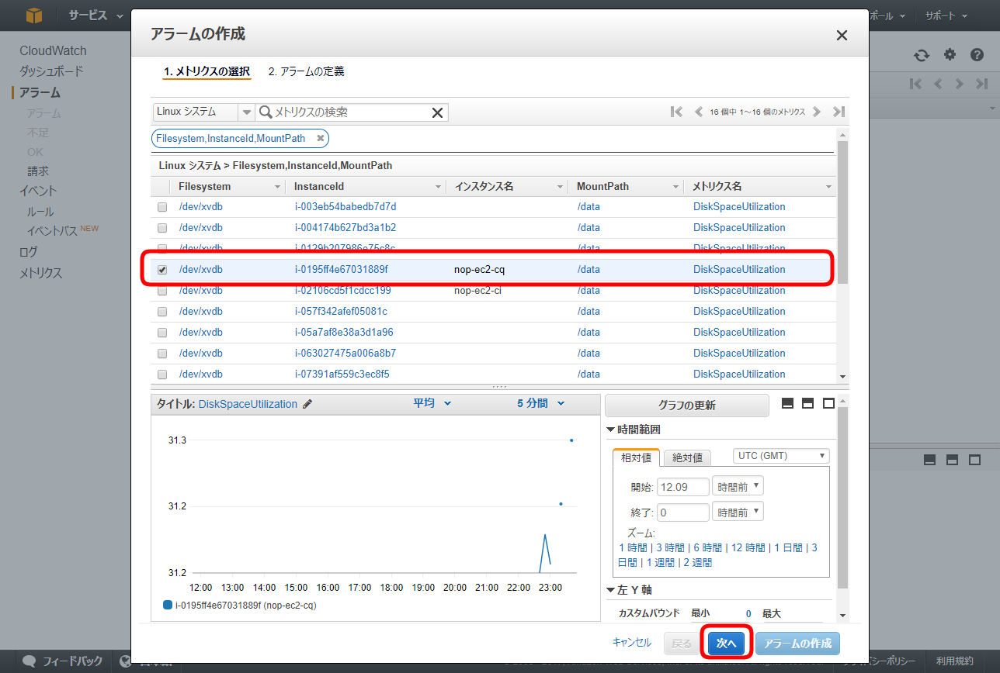
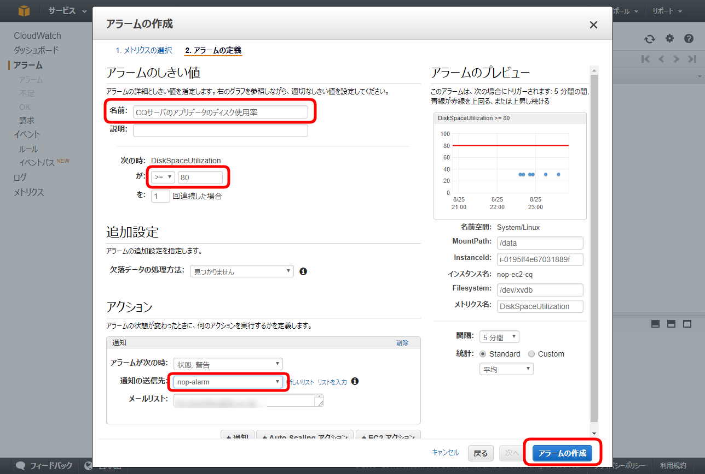
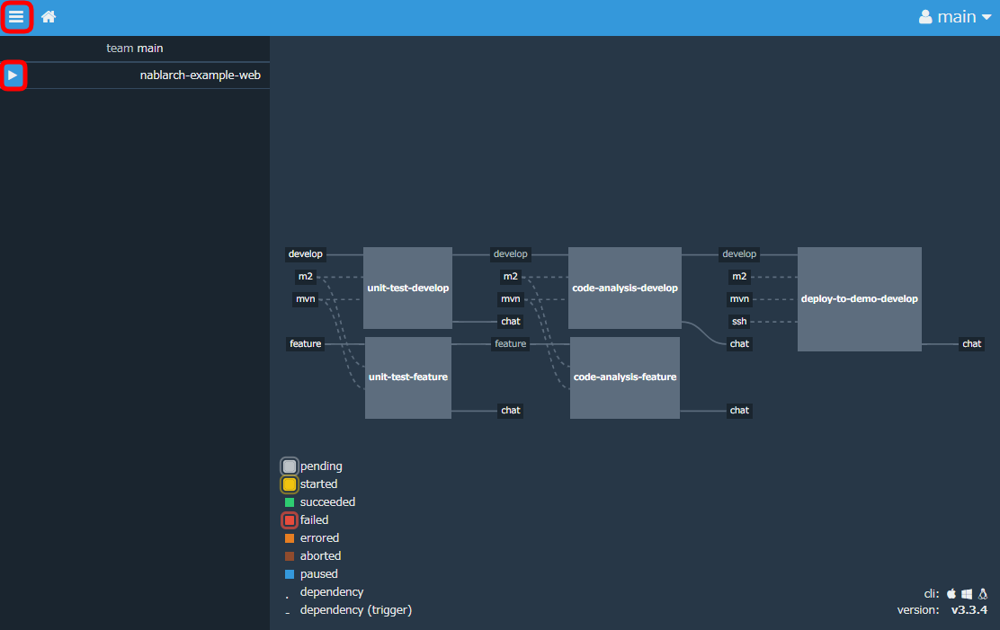

AMIから作成したEC2インスタンスの初期設定
================================================================

ここでは、Collaborageが提供するAMIから作成した各サーバの初期設定を行います。

ここでの作業内容は次の通りです。
- [バックアップ対象の目印となる名前をデータボリュームに設定します](#バックアップ対象の目印となる名前をデータボリュームに設定します)
- [CQサーバの設定を変更します](#cqサーバの設定を変更します)
- [CIサーバの設定を変更します](#ciサーバの設定を変更します)
- [Demoサーバの設定を変更します](#demoサーバの設定を変更します)
- [スナップショットとメトリクスが取得できていることを確認します](#スナップショットとメトリクスが取得できていることを確認します)
- [CloudWatchでディスク使用率にアラームを設定します](#cloudwatchでディスク使用率にアラームを設定します)
- [アプリにアクセスし、初期設定を行います](#アプリにアクセスし初期設定を行います)
- [リカバリに備えてAMIを作成します](#リカバリに備えてamiを作成します)


# 各サーバの状態を理解します


AMIは、次の手順で作成し、[Nablarch](https://github.com/nablarch/nablarch)の[Example](https://github.com/nablarch/nablarch-example-web)のCIを組み込んであります。

- [OSの初期設定～アプリのインストール](app.md)
- [アプリの初期設定](init.md)
- [プロジェクトの開発準備](dev.md)

各アプリでは、管理者、グループ、ユーザ、プロジェクト/リポジトリを次の内容で作成しています。

- 管理者
  - admin/pass123-（Redmine、Rocket.Chat、SonarQube、Nexus、Jenkins、Concourse）
  - root/pass123-（GitBucket、GitLab）
- グループ
  - sample（Redmine、GitBucket、GitLab）
- ユーザ
  - nop/pass456-（Redmine、Rocket.Chat、GitBucket、GitLab）
    - 開発メンバ
    - sampleグループに割り当て済みです。
  - jenkins/pass456-（Rocket.Chat）
    - JenkinsからCI結果を通知するためのユーザ
- プロジェクト/リポジトリ
  - nablarch-example-web（Redmine、GitBucket、GitLab）
    - sampleグループに割り当て済みです。

各サーバのディレクトリ構成は以下になります。
OSの初期設定やアプリのインストール時に使用したシェルスクリプトが多数ありますが、
ここではアプリの運用に関連する部分のみコメントします。

CQサーバとCIサーバ
```
home
  centos
    nop
      docker
        ci      … docker-compose.ymlがあります。CIサーバのアプリを操作する場所です。
        cq      … docker-compose.ymlがあります。CQサーバのアプリを操作する場所です。
      log       … cronのエラーログがあります。cronでエラーが発生するとメール通知されるので、ここのログを確認します。
      script
        config  … cronの設定内容があります。
        cron    … cronで呼び出すシェルファイルがあります。
```

Demoサーバ
```
home
  centos
    app         … アプリのデプロイ先です。Executable Jarをdockerで立ち上げています。
```


# バックアップ対象の目印となる名前をデータボリュームに設定します


- AWSマネジメントコンソールでEC2にアクセスし、「nop-ec2-cq」＞ブロックデバイスの「/dev/sdb」＞「EBS ID」のリンクを選択します。
  - 
- Name列にカーソルを持っていくと鉛筆アイコンが表示されるので選択し、「nop-ebs-data-cq」と指定します。
  - 
- 「nop-ec2-ci」インスタンスについても同じ操作で、データボリュームの名前に「nop-ebs-data-ci」と指定します。


# CQサーバの設定を変更します


- SSHでCQサーバにアクセスします。
- centosユーザのパスワードを変更します。
  ```
  $ passwd
  ```
  - 現在のパスワード: pass789-
- プロキシ環境下の場合は、centosユーザのプロキシの設定を変更します。
  ```
  $ vi ~/.bash_profile
  ```
  - プロキシ情報はネットワーク管理者に確認してください。
  - プロキシの設定のみ変更します。no_proxyは追加します。
    ```
    export HTTP_PROXY=http://26.247.64.251:3128
    export HTTPS_PROXY=http://26.247.64.251:3128
    export http_proxy=http://26.247.64.251:3128
    export https_proxy=http://26.247.64.251:3128
    export no_proxy=169.254.169.254
    ```
    - no_proxyには「169.254.169.254」を指定します。インスタンスメタデータを取得する際のIPになります。
      - cronで実行するバックアップ取得やメトリクス送信でAWS CLIを使います。
        プロキシ環境下で、EC2インスタンスにロールを指定してAWS CLIを使う場合に、インスタンスメタデータを取得するため、この設定が必要になります。
  - 設定を反映します。
    ```
    $ source ~/.bash_profile
    ```
- プロキシ環境下の場合は、yumのプロキシの設定を変更します。
  ```
  $ sudo vi /etc/yum.conf
  ```
  - 最後の行に以下を追加します。
    ```
    proxy=http://26.247.64.251:3128
    ```
- OSのパッケージを更新します。
  ```
  $ sudo yum -y update
  ```
- Rocket.Chatの設定を変更します。
  ```
  $ vi nop/docker/cq/docker-compose.yml
  ```
  - Rocket.Chatの外部URLを指定します。
    ```
    nop/docker/cq/docker-compose.yml
    ```
    - 「rocketchat」＞「environment」＞「ROOT_URL」に指定します。
      ```
      rocketchat:
        container_name: rocketchat
        # 省略
        environment:
          # 省略
          ROOT_URL: <ブラウザからrocketchatにアクセスする場合のURL>
      ```
- プロキシ環境下の場合は、Dockerコンテナのプロキシの設定を変更します。
  ```
  $ vi nop/docker/cq/common.env
  ```
  - プロキシの設定のみ変更します。
    ```
    HTTP_PROXY=http://26.247.64.251:3128
    HTTPS_PROXY=http://26.247.64.251:3128
    http_proxy=http://26.247.64.251:3128
    https_proxy=http://26.247.64.251:3128
    ```
- プロキシ環境下の場合は、SonarQubeのプロキシの設定を変更します。
  ```
  $ sudo vi nop/docker/cq/sonar.properties
  ```
  - プロキシの設定のみ変更します。
    ```
    http.proxyHost=26.247.64.251
    http.proxyPort=3128
    ```
- アプリを作り直します。
  - アプリを操作するディレクトリに移動します。
    ```
    $ cd nop/docker/cq/
    ```
  - アプリを停止して削除します。
    ```
    $ docker-compose down
    ```
  - アプリを作成して起動します。
    ```
    $ docker-compose up -d
    ```
  - RedmineにサブURIの設定を入れます。
    ```
    $ ./redmine-sub-uri.sh
    ```
- トピックのARNを変更します。
  ```
  $ vi ~/.bash_profile
  ```
  - AWSマネジメントコンソールでSNSにアクセスし、トピックのARNを確認します。
    - 
  - AWS_SNS_TOPICのみ変更します。
  ```
  export AWS_SNS_TOPIC=arn:aws:sns:ap-northeast-1:746256062285:nop-alarm
  ```
  - 設定を反映します。
    ```
    $ source ~/.bash_profile
    ```
- プロキシ環境下の場合は、Amazon CloudWatch モニタリングスクリプトをプロキシ環境下で使うための設定を行います。
  - 環境変数を追加します。
    ```
    $ vi ~/.bash_profile
    ```
    - 2つの環境変数を追加します。
      ```
      export PERL_NET_HTTPS_SSL_SOCKET_CLASS=Net::SSL
      export PERL_LWP_SSL_VERIFY_HOSTNAME=0
      ```
    - 設定を反映します。
      ```
      $ source ~/.bash_profile
      ```
  - パッケージをインストールします。
    ```
    $ sudo yum install perl-Switch perl-DateTime perl-Sys-Syslog perl-LWP-Protocol-https -y
    $ sudo yum install perl-Net-SSLeay perl-Crypt-SSLeay perl-IO-Socket-SSL -y
    ```
- cronを設定します。
  ```
  $ cd ~/nop/script/
  $ ./set-cron-after-try-command.sh
  ```
  - テストメールの送信、CloudWatchへのメトリクス送信、EBS(データボリューム)のスナップショット取得を実行し、
    エラーが出なければcronの設定を行い、cronの設定内容が表示されます。
- SSHを切断します。
  ```
  $ exit
  ```


# CIサーバの設定を変更します


- SSHでCIサーバにアクセスします。
- centosユーザのパスワードを変更します。
  ```
  $ passwd
  ```
  - 現在のパスワード: pass789-
- プロキシ環境下の場合は、centosユーザのプロキシの設定を変更します。
  ```
  $ vi ~/.bash_profile
  ```
  - プロキシの設定のみ変更します。no_proxyは追加します。
    ```
    export HTTP_PROXY=http://26.247.64.251:3128
    export HTTPS_PROXY=http://26.247.64.251:3128
    export http_proxy=http://26.247.64.251:3128
    export https_proxy=http://26.247.64.251:3128
    export no_proxy=169.254.169.254
    ```
    - no_proxyには「169.254.169.254」を指定します。インスタンスメタデータを取得する際のIPになります。
      - cronで実行するバックアップ取得やメトリクス送信でAWS CLIを使います。
        プロキシ環境下で、EC2インスタンスにロールを指定してAWS CLIを使う場合に、インスタンスメタデータを取得するため、この設定が必要になります。
  - 設定を反映します。
    ```
    $ source ~/.bash_profile
    ```
- プロキシ環境下の場合は、yumのプロキシの設定を変更します。
  ```
  $ sudo vi /etc/yum.conf
  ```
  - 最後の行に以下を追加します。
    ```
    proxy=http://26.247.64.251:3128
    ```
- OSのパッケージを更新します。
  ```
  $ sudo yum -y update
  ```
- プロキシ環境下の場合は、Dockerコンテナのプロキシの設定を変更します。
  ```
  $ vi nop/docker/ci/common.env
  ```
  - プロキシの設定のみ変更します。
    ```
    HTTP_PROXY=http://26.247.64.251:3128
    HTTPS_PROXY=http://26.247.64.251:3128
    http_proxy=http://26.247.64.251:3128
    https_proxy=http://26.247.64.251:3128
    ```
- Concourse/GitLabを使う場合はアプリの設定を変更します。
  ```
  $ vi nop/docker/ci/docker-compose.yml
  ```
  - Concourseを使用する場合は、Concourseの外部URLとログインに使用するユーザ名/パスワードを指定します。
    ```
    nop/docker/ci/docker-compose.yml
    ```
    - 「concourse-web」＞「environment」＞「CONCOURSE_XXXXXXXX」に指定します。
      ```
      concourse-web:
        container_name: concourse-web
        # 省略
        environment:
          # 省略
          CONCOURSE_EXTERNAL_URL: <ブラウザからConcourseにアクセスする場合のURL>
          CONCOURSE_BASIC_AUTH_USERNAME: <ユーザ名>
          CONCOURSE_BASIC_AUTH_PASSWORD: <パスワード>
          CONCOURSE_NO_REALLY_I_DONT_WANT_ANY_AUTH:
      ```
    - ConcourseのURLは「<ホスト>/」となります。Concourseはベースパスに対応していないため、URLはパス指定なしです。設定例を示します。
      ```
      CONCOURSE_EXTERNAL_URL: https://nop-ci.adc-tis.com/
      CONCOURSE_BASIC_AUTH_USERNAME: admin
      CONCOURSE_BASIC_AUTH_PASSWORD: password
      ```
  - プロキシ環境下でConcourseを使用する場合は、さらにno_proxyにCQサーバのホストを追加します。
    ```
    nop/docker/ci/docker-compose.yml
    ```
    - 「concourse-worker」＞「environment」＞「no_proxy」に追記します。「26.247.128.119」を追記しています。
      ```
      concourse-worker:
        container_name: concourse-worker
        # 省略
        environment:
          # 省略
          no_proxy: proxy,nexus.repository,26.247.128.119
      ```
  - GitLabの外部URLを指定します。
    - 「gitlab」＞「environment」＞「GITLAB_OMNIBUS_CONFIG」＞「external_url」に指定します。
      ```
      gitlab:
        container_name: gitlab
        # 省略
        environment:
          GITLAB_OMNIBUS_CONFIG: |
            external_url '<ブラウザからGitLabにアクセスする場合のURL>'
            gitlab_rails['time_zone'] = 'Tokyo'
       ```
    - GitLabのURLは「<ホスト>/gitlab」となります。設定例を示します。
      ```
      external_url 'https://nop-ci.adc-tis.com/gitlab/'
      ```
  - GitLabの外部URLがhttpsでない場合は、以下の設定をコメントアウトします。
    ```
    nginx['proxy_set_headers'] = {
      "X-Forwarded-Proto" => "https",
      "X-Forwarded-Ssl" => "on"
    }
    ```
    - 先頭に「#」を付けます。
    ```
    #nginx['proxy_set_headers'] = {
    #  "X-Forwarded-Proto" => "https",
    #  "X-Forwarded-Ssl" => "on"
    #}
    ```
- アプリを作り直します。
  - アプリを操作するディレクトリに移動します。
    ```
    $ cd nop/docker/ci/
    ```
  - アプリを停止して削除します。
    ```
    $ docker-compose down
    ```
  - Concourseを使う場合はデータを削除します。
    ```
    $ sudo rm -rf /data/concourse*
    ```
  - アプリを作成して起動します。
    ```
    $ docker-compose up -d
    ```
- トピックのARNを変更します。
  ```
  $ vi ~/.bash_profile
  ```
  - AWSマネジメントコンソールでSNSにアクセスし、トピックのARNを確認します。
    - 
  - AWS_SNS_TOPICのみ変更します。
  ```
  export AWS_SNS_TOPIC=arn:aws:sns:ap-northeast-1:746256062285:nop-alarm
  ```
  - 設定を反映します。
    ```
    $ source ~/.bash_profile
    ```
- プロキシ環境下の場合は、Amazon CloudWatch モニタリングスクリプトをプロキシ環境下で使うための設定を行います。
  - 環境変数を追加します。
    ```
    $ vi ~/.bash_profile
    ```
    - 2つの環境変数を追加します。
      ```
      export PERL_NET_HTTPS_SSL_SOCKET_CLASS=Net::SSL
      export PERL_LWP_SSL_VERIFY_HOSTNAME=0
      ```
    - 設定を反映します。
      ```
      $ source ~/.bash_profile
      ```
  - パッケージをインストールします。
    ```
    $ sudo yum install perl-Switch perl-DateTime perl-Sys-Syslog perl-LWP-Protocol-https -y
    $ sudo yum install perl-Net-SSLeay perl-Crypt-SSLeay perl-IO-Socket-SSL -y
    ```
- cronを設定します。
  ```
  $ cd ~/nop/script/
  $ ./set-cron-after-try-command.sh
  ```
  - テストメールの送信、CloudWatchへのメトリクス送信、EBS(データボリューム)のスナップショット取得を実行し、
    エラーが出なければcronの設定を行い、cronの設定内容が表示されます。
- SSHを切断します。
  ```
  $ exit
  ```


# Demoサーバの設定を変更します


- SSHでDemoサーバにアクセスします。
- centosユーザのパスワードを変更します。
  ```
  $ passwd
  ```
  - 現在のパスワード: pass789-
- プロキシ環境下の場合は、centosユーザのプロキシの設定を変更します。
  ```
  $ vi ~/.bash_profile
  ```
  - プロキシの設定のみ変更します。
    ```
    export HTTP_PROXY=http://26.247.64.251:3128
    export HTTPS_PROXY=http://26.247.64.251:3128
    export http_proxy=http://26.247.64.251:3128
    export https_proxy=http://26.247.64.251:3128
    ```
  - 設定を反映します。
    ```
    $ source ~/.bash_profile
    ```
- プロキシ環境下の場合は、yumのプロキシの設定を変更します。
  ```
  $ sudo vi /etc/yum.conf
  ```
  - 最後の行に以下を追加します。
    ```
    proxy=http://26.247.64.251:3128
    ```
- OSのパッケージを更新します。
  ```
  $ sudo yum -y update
  ```
- プロキシ環境下の場合は、Dockerのプロキシの設定を変更します。
  - docker.serviceをコピーします。
    ```
    $ sudo cp /usr/lib/systemd/system/docker.service /etc/systemd/system/
    ```
  - コピーしたdocker.serviceにProxyの設定を追加します。
    ```
    $ sudo vi /etc/systemd/system/docker.service
    ```
    - ExecStartコマンドの直前にProxyの設定を追加します。
      ```
      Environment="HTTP_PROXY=http://26.247.64.251:3128"
      ```
  - 設定の再読込とDockerの再起動を行います。
    ```
    $ sudo systemctl daemon-reload
    $ sudo systemctl restart docker
    ```
- SSHを切断します。
  ```
  $ exit
  ```


# スナップショットとメトリクスが取得できていることを確認します


- AWSマネジメントコンソールでEC2にアクセスし、スナップショットを確認します。
  - 
  - 名前:nop-ebs-data-cq-snapshot、nop-ebs-data-ci-snapshotで取得されます。
- AWSマネジメントコンソールでCloudWatchにアクセスし、メトリクスを確認します。
  - 「メトリクス」＞「Linuxシステム」＞「Filesystem, InstanceId, MountPath」を選択します
    - 
    - 
  - MountPath:/data、メトリクス名:DiskSpaceUtilizationで取得されます。
    - メトリクスを選択すると、グラフに表示され、インスタンスの名前(nop-ec2-cq、nop-ec2-ci)を確認できます。
      - 


# CloudWatchでディスク使用率にアラームを設定します


- AWSマネジメントコンソールでCloudWatchにアクセス、「アラーム」＞「アラームの作成」を選択します。
- 先ほど確認したメトリクスを選択し次に進みます。
  - 
- アラームの定義を指定して作成します。
  - 
    - 「名前」、「しきい値」、「通知の送信先」を指定します。


# アプリにアクセスし、初期設定を行います


## Redmine

- ブラウザでアクセスします。
  ```
  <CQサーバのホスト>/redmine
  ```
- ブラウザでアクセスしたURLをブックマークしておきます。
- 管理者でログインします。
  - 画面右上の「ログイン」を選択します。
    - ログインID: admin
    - パスワード: pass123-
- 管理者のパスワードを変更します。
  - 画面右上の「個人設定」＞「パスワード変更」を選択します。
  - パスワードを変更します。

## Rocket.Chat

- ブラウザでアクセスします。
  ```
  <CQサーバのホスト>/rocketchat
  ```
- ブラウザでアクセスしたURLをブックマークしておきます。
- 管理者でログインします。
  - ユーザ名: admin
  - パスワード: pass123-
- サイトURL設定のWarningが表示されるので「はい」を選択します。
- 管理者のパスワードを変更します。
 - 画面左上のadmin横のプルダウン＞「マイアカウント」＞「プロフィール」を選択します。
   - 新しいパスワードを入力して、変更を保存します。
   - 変更前のパスワードの入力が求められるので「pass123-」を入力します。

## SonarQube

- ブラウザでアクセスします。
  ```
  <CQサーバのホスト>/sonarqube
  ```
- ブラウザでアクセスしたURLをブックマークしておきます。
- 管理者でログインします。
  - 画面右上の「Log in」を選択します。
    - Login: admin
    - Password: pass123-
- 管理者のパスワードを変更します。
  - 画面右上の「Administration」＞「Security」＞「Users」を選択します。
    - adminの鍵アイコン「Change password」を選択し、パスワードを変更します。

## Nexus

- ブラウザでアクセスします。
  ```
  <CIサーバのホスト>/nexus
  ```
- ブラウザでアクセスしたURLをブックマークしておきます。
- 管理者でログインします。
  - 画面右上の「Sign in」を選択します。
    - Username: admin
    - Password: pass123-
- 管理者のパスワードを変更します。
  - 画面右上の「admin」＞「Change password」を選択します。
    - はじめに、再度認証が求められるので、変更前のパスワード「pass123-」を指定して、パスワードを変更します。
- プロキシ環境下の場合は、プロキシの設定を行います。
  - 画面左上の「歯車(Server administration and configuration)」アイコン＞画面左のSystemの「HTTP」を選択します。
    - HTTP proxy: チェックしてプロキシを設定します。
    - HTTPS proxy: チェックしてプロキシを設定します。
    - Saveします。

## GitBucket

- ブラウザでアクセスします。
  ```
  <CIサーバのホスト>/gitbucket
  ```
- ブラウザでアクセスしたURLをブックマークしておきます。
- 管理者でログインします。  
  - 画面右上の「Sign in」を選択します。
    - Username: root
    - Password: pass123-
  - Base URLの設定がされていないため、存在しないURLに遷移した場合は、再度「`<CIサーバのホスト>/gitbucket`」にアクセスするとログイン済みの画面が表示されます。
- 管理者のパスワードを変更します。
  - 画面右上のプルダウン(＋の右となり)＞「Account Settings」
    - Password (input to change password): 新しいパスワード
    - Saveします。
- Base URLを設定します。
  - 画面右上のプルダウン(＋の右となり)＞「System Administration」＞「System Settings」を選択します。
    - Base URL (e.g. http://example.com/gitbucket): ブラウザでアクセスしたURLを指定します。
    - Apply changesします。

## Jenkins

- ブラウザでアクセスします。
  ```
  <CIサーバのホスト>/jenkins
  ```
- ブラウザでアクセスしたURLをブックマークしておきます。
- 管理者でログインします。
  - 画面右上の「ログイン」を選択します。
    - Username: admin
    - Password: pass123-
- 管理者のパスワードを変更します。
  - 画面右上のadminにカーソルを合わせて表示されるプルダウン＞「設定」
    - パスワードを入力し、保存します。
- プロキシ環境下の場合は、プロキシの設定を行います。
  - ロゴを選択してトップページを表示します。
  - 画面左の「Jenkinsの管理」＞「プラグインの管理」＞「高度な設定」タブを選択します。
    - HTTP Proxyの設定を入力し、保存します。
      - 対象外ホスト: Jenkinsからアクセスする可能性がある「proxy(docker-composeのサービス名)」と「CQサーバのプライベートIP」をカンマ区切りで指定します。
        - 例: proxy,10.0.1.110
        - 指定内容は[URLの仕組み](url.md)を参照してください。
- RocketChatへの通知設定を変更します。
  - ロゴを選択してトップページを表示します。
  - 画面左の「Jenkinsの管理」＞「システムの設定」を選択します。
    - 画面一番下のGlobal RocketChat Notifier Settingsを指定します。
      - Rocket Server URL: Rocket.ChatのURLを指定します。
      - [URLの仕組み](url.md)を参照し、環境に合わせて適切なURL指定を行ってください。
      - 例: http://10.0.1.110/rocketchat/
    - Build Server URL: JenkinsのURLを指定します。
      - こちらはブラウザでアクセスする場合と同じURLを指定します。
      - 例: https://nop-ci.adc-tis.com/jenkins
    - Test Connectionします。Successと表示されればOKです。Rocket.Chatのチャンネルにメッセージが届いています。
      - メッセージのリンクをクリックしてJenkinsへ移動できることを確認します。
    - 保存します。
- nablarch-example-webのパイプラインを変更します。
  - GibBucketにnopユーザでログインします。
    - Username: nop
    - Password: pass456-
  - 画面左にある「sample/nablarch-example-web」を選択します。
  - 画面右側にあるリポジトリのURLをコピーします。
  - 作業PCの適当な場所にgit cloneします。
    - ユーザ名/パスワードを聞かれるのでnopユーザを指定します。
    - 503エラーとなった場合は環境変数no_proxyにCIサーバのホストを設定します。
      ```
      $ export no_proxy=26.247.135.132
      ```
  - いくつか設定ファイルを変更していくので、IDEでnablarch-example-web(Mavenプロジェクト)を開きます。
  - ブランチを「develop」に切り替えます。
  - パイプラインのパラメータを変更します。
    ```
    nablarch-example-web/Jenkinsfile
    ```
    - 環境変数を修正します。
      ```
      environment {
        SONAR_HOST_URL = '<SonarQubeのURL>'
        DEMO_HOST = '<Demoサーバのホスト>'
        DEMO_PORT = '<DemoサーバのSSHのポート番号>'
        DEMO_USERNAME = '<DemoサーバのSSHのユーザ名>'
        DEMO_PASSWORD = '<DemoサーバのSSHのパスワード>'
      }
      ```
      - [URLの仕組み](url.md)を参照し、環境に合わせて適切なURL指定を行ってください。
      - こんな感じになります。
        ```
        environment {
          SONAR_HOST_URL = 'http://10.0.1.110/sonarqube'
          DEMO_HOST = '10.0.1.63'
          DEMO_PORT = '22'
          DEMO_USERNAME = 'centos'
          DEMO_PASSWORD = 'pass789-'
        }
        ```
- pushします。
- Jenkinsが変更を検知してジョブが実行されます。
  - CI結果（テスト、デプロイなど）はRocket.Chatに通知されます。
  - 「Deploy to demo」まで成功すると、デプロイされたアプリにアクセスできます。ブラウザでアクセスします。
    ```
    <DEMOサーバのホスト>/
    ```
    - ログインID: 10000001
    - パスワード: pass123-

## GitLab

- ブラウザでアクセスします。
  ```
  <CIサーバのホスト>/gitlab
  ```
- ブラウザでアクセスしたURLをブックマークしておきます。
- 管理者でログインします。
  - 画面右上の「Sign in」を選択します。
    - Username: root
    - Password: pass123-
- 管理者のパスワードを変更します。
  - 画面右上のプルダウン＞「Settings」＞「Password」タブを選択します。
    - パスワードを変更します。
- ConcourseからリポジトリにアクセスできるようにプロジェクトをPublicに変更します。
  - 「sample」グループを公開します。
    - 左上のメニューから「Groups」＞「Your groups」＞「sample」を選択します。
    - 「Settings」タブを選択します。
    - 「Visibility Level」を「Public」に変更し、「Save group」します。
  - 「nablarch-example-web」プロジェクトを公開します。
    - ロゴを選択しトップページ＞「Your projects」＞「sample/nablarch-example-web」を選択します。
    - 「Settings」タブを選択します。
    - 「Project Visibility」を「Public」に変更し、「Save changes」します。

## Concourse

- ブラウザでアクセスします。
  ```
  <CIサーバのホスト>/    ※Concourseはベースパスに対応していないため、URLはパス指定なしです。
  ```
- ブラウザでアクセスしたURLをブックマークしておきます。
- ログインします。
  - 画面右上の「login」を選択します。
    - 「main」を選択します
      - username/password: docker-composeの定義ファイルに指定したものを指定します。
      - 画面右上にmainと表示されればログイン成功です。
- nablarch-example-webのパイプラインを変更します。
  - GibLabにnopユーザでログインします。
    - Username: nop
    - Password: pass456-
  - 「sample/nablarch-example-web」を選択します。
  - 画面中央にあるリポジトリのURLをコピーします。
  - 作業PCの適当な場所にgit cloneします。
    - ユーザ名/パスワードを聞かれるのでnopユーザを指定します。
    - 503エラーとなった場合は環境変数no_proxyにCIサーバのホストを設定します。
      ```
      $ export no_proxy=26.247.135.132
      ```
  - いくつか設定ファイルを変更していくので、IDEでnablarch-example-web(Mavenプロジェクト)を開きます。
  - ブランチを「develop」に切り替えます。
  - パイプラインのパラメータを変更します。
    ```
    nablarch-example-web/ci/params.yml
    ```
    - [URLの仕組み](url.md)を参照し、環境に合わせて適切なURL指定を行ってください。
    - パラメータの設定は以下のような感じになります。
      ```
      git-project-url: http://proxy/gitlab/sample/nablarch-example-web.git

      docker-repo-host-port: nexus.repository:18444
      docker-repo-username: admin
      docker-repo-password: pass123-

      sonar-url: http://10.0.1.217/sonarqube

      chat-webhook-url: http://10.0.1.217/rocketchat/hooks/KMFduPo2KDqRLsAwp/RkL...

      demo-host: 10.0.1.121
      demo-port: 22
      demo-username: centos
      demo-password: pass789-
      ```
  - パイプラインで使うMavenの設定を変更します。
    ```
    nablarch-example-web/ci/settings.xml
    ```
    - Nexusのユーザ名/パスワードだけを変更します。
  - pushします。
- Concouseにパイプラインを設定します。
  - Concourseへのパイプライン設定はflyコマンドで行います。
  - Concourseにアクセスしてツールをダウンロードします。
  - ログアウトしてConcourseのトップページにアクセスします。
    - 作業マシンのOSと同じアイコン(画面中央にあります)を選択して、ツールをダウンロードします。
    - ツールにパスを通すか、nablarch-example-web/ciに置いて直接実行して使います。
  - flyコマンドでConcouseにログインします。パスを通してない場合は「fly」→「fly.exe」で実行してください。
    ```
    $ cd <nablarch-example-web/ciへのパス>
    $ fly -t main login -c <ConcourseのURL> -k
    ```
    - ConcourseのURLはブラウザでアクセスする場合と同じものを指定します。
    - username/passwordが聞かれるので、docker-composeの定義ファイルに指定したものを入力します。
      - 「target saved」と表示されればログイン成功です。
      - こんな感じになります。
        ```
        $ fly -t main login -c https://nop-ci.adc-tis.com/ -k
        logging in to team 'main'
        
        username: concourse
        concourse
        password: password
        
        target saved
        ```
  - パイプラインの設定をしたいので、flyコマンドでパイプラインを一旦削除します。
    ```
    $ fly -t main dp -p nablarch-example-web
    ```
    - 「are you sure? [yN]」と聞かれるので「y」と答えます。
  - flyコマンドでパイプラインを設定します。
    ```
    $ fly -t main sp -p nablarch-example-web -c pipeline.yml -l params.yml
    ```
    - 「apply configuration? [yN]」と聞かれるので「y」と答えます。
    - パイプラインを変更した場合はこのコマンドで更新します。
  - ブラウザでConcourseにアクセスしてCIを実行します。
    - Concourseがパイプラインを検知して、画面にパイプラインが表示されます。
    - 表示されない場合は画面を更新してください。
    - はじめは一時停止状態なので、画面左上の「メニュー」＞nablarch-example-webの「再生」アイコンを選択します。
      - 
  - 初回は大量の依存モジュールを落としてくるため、少し時間（5分～10分ぐらい）がかかります。
  - CI結果（テスト、デプロイなど）はRocket.Chatに通知されます。
  - 「deploy-to-demo-develop」まで成功すると、デプロイされたアプリにアクセスできます。ブラウザでアクセスします。
    ```
    <DEMOサーバのホスト>/
    ```
    - ログインID: 10000001
    - パスワード: pass123-


# リカバリに備えてAMIを作成します


一通り、初期設定が完了したら、EC2インスタンスが故障した場合に備えて、
各EC2インスタンスのイメージを作成しておきます。

- AWSマネジメントコンソールでEC2にアクセスします。
- インスタンスを選択＞「アクション」＞「イメージ」＞「イメージの作成」を選択して、イメージを作成します。
