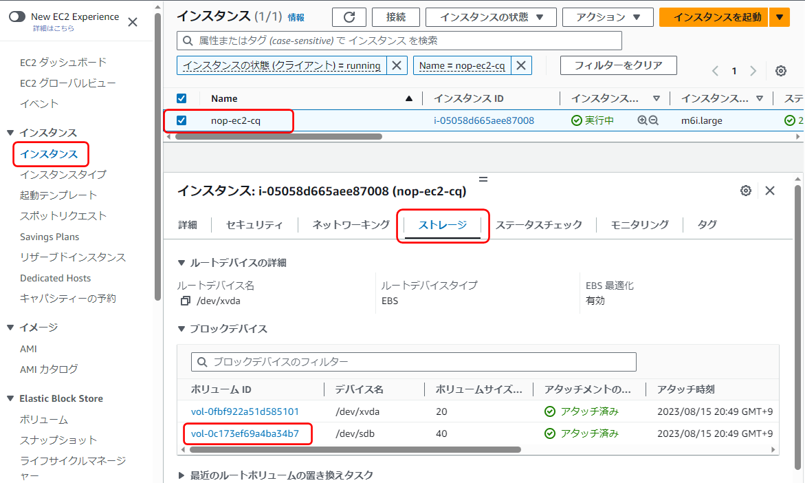
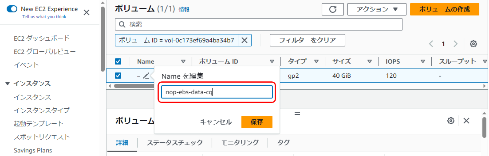
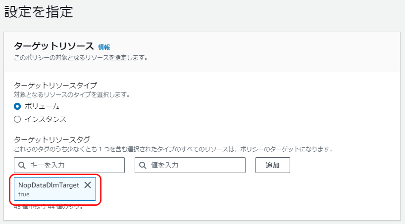
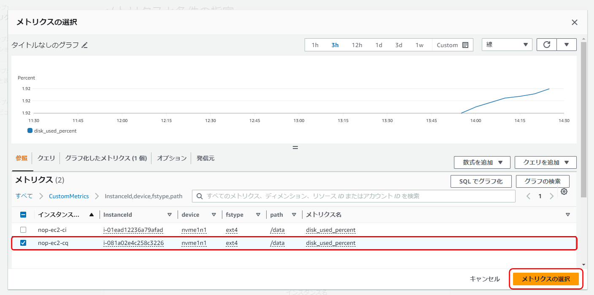
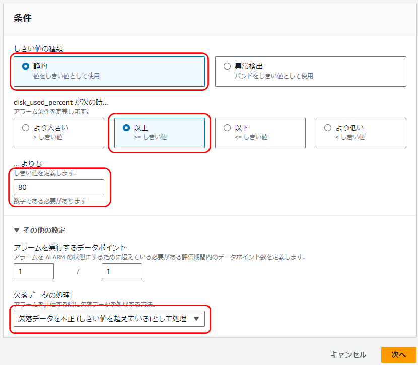

AMIから作成したEC2インスタンスの初期設定
================================================================

ここでは、Collaborageが提供するAMIから作成した各サーバの初期設定を行います。

ここでの作業内容は次の通りです。
- [データボリュームを定期的にバックアップするように設定します](#データボリュームを定期的にバックアップするように設定します)
- [CQサーバの設定を変更します](#cqサーバの設定を変更します)
- [CIサーバの設定を変更します](#ciサーバの設定を変更します)
- [Demoサーバの設定を変更します](#demoサーバの設定を変更します)
- [メトリクスが取得できていることを確認します](#メトリクスが取得できていることを確認します)
- [CloudWatchでディスク使用率にアラームを設定します](#cloudwatchでディスク使用率にアラームを設定します)
- [CloudWatchでバックアップ失敗時の通知を設定します](#cloudwatchでバックアップ失敗時の通知を設定します)
- [アプリにアクセスし、初期設定を行います](#アプリにアクセスし初期設定を行います)
- [リカバリに備えてAMIを作成します](#リカバリに備えてamiを作成します)


# 各サーバの状態を理解します


AMIは、次の手順で作成し、[Eclipse starter for jakarta ee](https://start.jakarta.ee/)のサンプルプロジェクトにユニットテスト、コード解析、デプロイ、Dockerイメージ作成のCIを組み込んであります。

- [OSの初期設定～アプリのインストール](app.md)
- [アプリの初期設定](init.md)
- [プロジェクトの開発準備](dev.md)

各アプリでは、管理者、グループ、ユーザ、プロジェクト/リポジトリを次の内容で作成しています。

- 管理者
  - admin/pass123-（Redmine、SonarQube、Nexus、Jenkins、Subversion）
  - root/pass123-（Rocket.Chat、GitBucket、GitLab、Subversion）
- グループ
  - sample（Redmine、GitBucket、GitLab）
- ユーザ
  - nop/pass456-（Redmine、SonarQube、Rocket.Chat、GitBucket、GitLab、Subversion）
    - 開発メンバ
    - sampleグループに割り当て済みです。
  - jenkins/pass456-（Rocket.Chat）
    - JenkinsからCI結果を通知するためのユーザ
- プロジェクト/リポジトリ
  - jakartaee-hello-world（Redmine、GitBucket、GitLab）
    - sampleグループに割り当て済みです。

各サーバのディレクトリ構成は以下になります。
OSの初期設定やアプリのインストール時に使用したシェルスクリプトが多数ありますが、
ここではアプリの運用に関連する部分のみコメントします。

CQサーバとCIサーバ
```
home
  ec2-user
    nop
      docker
        ci      … docker-compose.ymlがあります。CIサーバのアプリを操作する場所です。
        cq      … docker-compose.ymlがあります。CQサーバのアプリを操作する場所です。
      log       … cronのエラーログがあります。cronでエラーが発生するとメール通知されるので、ここのログを確認します。
      script
        config  … cronの設定内容があります。
        cron    … cronで呼び出すシェルファイルがあります。
```

Demoサーバ
```
home
  ec2-user
    app         … アプリのデプロイ先です。Warをdockerで立ち上げています。
```

# データボリュームを定期的にバックアップするように設定します
- バックアップ対象の目印となるタグをデータボリュームに設定します。
  - AWSマネジメントコンソールでEC2にアクセスし、「nop-ec2-cq」＞ストレージ＞ブロックデバイスの「/dev/sdb」＞「ボリュームID」のリンクを選択します。
    - 
  - Name列にカーソルを持っていくと鉛筆アイコンが表示されるので選択し、「nop-ebs-data-cq」と指定します。
    - 
  - タグを追加します。
    - タグタブに切り替えて、「タグを管理」をクリックします。
      - キーと値を入力して、「保存」をクリックします。
        - キー: NopDataDlmTarget
        - 値: true
        - 
  - 「nop-ec2-ci」インスタンスについても同じ操作で名前とタグの追加を行います。
    - データボリュームの名前に「nop-ebs-data-ci」と指定します。
    - 「nop-ec2-cq」に設定したものと同一のタグを追加します。

- データボリュームのバックアップのスケジュールを設定します。
  - AWSマネジメントコンソールでEC2にアクセスし、「ライフサイクルマネージャー」＞「ライフサイクルポリシーを作成」を設定します。
    - ポリシータイプを選択
      - ポリシータイプ: EBS スナップショットポリシー
      - 「次のステップ」を選択
    - 設定を指定
      - ターゲットリソース: ボリューム
        - ターゲットリソースタイプ
          - キー: NopDataDlmTarget
          - 値: true
          - タグはテキストボックスをクリックすると表示される選択肢から選びます。  
            選ぶと以下のようになります。
            - 
      - 説明: nop-data-volume-backup
      - IAMロール: デフォルトロール
    - スケジュール 1 を設定
      - スケジュール名: nop-data-volume-backup-schedule
      - 頻度:　毎日
      - 毎: 24時間
      - 開始時刻: 14:10 UTC (日本時間で23:10)
      - 保持タイプ: 保持期間
        - 保持期間: 7日
      - タグ付け
        - ソースからタグをコピー: ON

- スナップショットの取得に成功していることを翌日確認します。  
  ライフサイクルマネージャーは「指定された開始時刻から1時間以内に作成が開始される」仕様であり、設定後、すぐに確認できないためです。

# CQサーバの設定を変更します


- SSHでCQサーバにアクセスします。
- ec2-userユーザのパスワードを変更します。
  ```
  $ passwd
  ```
  - 現在のパスワード: pass789-
- プロキシ環境下の場合は、ec2-userユーザのプロキシの設定を変更します。
  ```
  $ vi ~/.bash_profile
  ```
  - プロキシ情報はネットワーク管理者に確認してください。
  - プロキシの設定のみ変更します。no_proxyは追加します。
    ```
    export HTTP_PROXY=http://<プロキシサーバのIPアドレス>:<ポート番号>
    export HTTPS_PROXY=http://<プロキシサーバのIPアドレス>:<ポート番号>
    export http_proxy=http://<プロキシサーバのIPアドレス>:<ポート番号>
    export https_proxy=http://<プロキシサーバのIPアドレス>:<ポート番号>
    export no_proxy=169.254.169.254
    ```
    - no_proxyには「169.254.169.254」を指定します。インスタンスメタデータを取得する際のIPになります。
      - cronで実行するメトリクス送信でAWS CLIを使います。
        プロキシ環境下で、EC2インスタンスにロールを指定してAWS CLIを使う場合に、インスタンスメタデータを取得するため、この設定が必要になります。
    - こんな感じになります。
      ```
      export HTTP_PROXY=http://192.0.2.1:3128
      export HTTPS_PROXY=http://192.0.2.1:3128
      export http_proxy=http://192.0.2.1:3128
      export https_proxy=http://192.0.2.1:3128
      export no_proxy=169.254.169.254
      ```
  - 設定を反映します。
    ```
    $ source ~/.bash_profile
    ```
- プロキシ環境下の場合は、dnfのプロキシの設定を変更します。
  ```
  $ sudo vi /etc/dnf/dnf.conf
  ```
  - 最後の行に以下を追加します。
    ```
    proxy=http://<プロキシサーバのIPアドレス>:<ポート番号>
    ```
    - こんな感じになります。
      ```
      proxy=http://192.0.2.1:3128
      ```
- OSのパッケージを更新します。
  ```
  $ sudo dnf -y update
  ```
- SSHを切断します。
  ```
  $ exit
  ```
- サービスを再起動するため、EC2のインスタンスごと一度停止し起動しなおします。
  - AWSマネジメントコンソールでEC2にアクセスし、nop-ec2-cqのインスタンスを選択します。
  - 画面上部の「アクション」＞「インスタンスの状態」＞「停止」を選択します。  
    (「再起動」でもよいのですが、時間が掛かることがあります。一度「停止」することをお勧めします。)
  - 停止するまで待ちます。
  - 画面上部の「アクション」＞「インスタンスの状態」＞「開始」を選択します。
- SSHでCQサーバにアクセスします。  
  AWSマネジメントコンソール上で起動しても接続できない場合があります。  
  その場合は待ちます(5分以上待つ必要があることもあります)。
- Rocket.Chatの設定を変更します。
  ```
  $ vi nop/docker/cq/docker-compose.yml
  ```
  - Rocket.Chatの外部URLを指定します。
    ```
    nop/docker/cq/docker-compose.yml
    ```
    - 「rocketchat」＞「environment」＞「ROOT_URL」に指定します。
      ```
      rocketchat:
        container_name: rocketchat
        # 省略
        environment:
          # 省略
          ROOT_URL: <ブラウザからrocketchatにアクセスする場合のURL>
      ```
    - Rocket.ChatのURLは「<ホスト>/rocketchat」となります。設定例を示します。
      ```
      ROOT_URL: https://nop-cq.adc-tis.com/rocketchat/
      ```
- プロキシ環境下の場合は、Dockerコンテナのプロキシの設定を変更します。
  ```
  $ vi nop/docker/cq/common.env
  ```
  - プロキシの設定のみ変更します。
    ```
    HTTP_PROXY=http://<プロキシサーバのIPアドレス>:<ポート番号>
    HTTPS_PROXY=http://<プロキシサーバのIPアドレス>:<ポート番号>
    http_proxy=http://<プロキシサーバのIPアドレス>:<ポート番号>
    https_proxy=http://<プロキシサーバのIPアドレス>:<ポート番号>
    ```
    - こんな感じになります。
      ```
      HTTP_PROXY=http://192.0.2.1:3128
      HTTPS_PROXY=http://192.0.2.1:3128
      http_proxy=http://192.0.2.1:3128
      https_proxy=http://192.0.2.1:3128
      ```
- プロキシ環境下の場合は、SonarQubeのプロキシの設定を変更します。
  ```
  $ sudo vi nop/docker/cq/sonar.properties
  ```
  - プロキシの設定のみ変更します。
    ```
    http.proxyHost=<プロキシサーバのIPアドレス>
    http.proxyPort=<ポート番号>
    ```
    - こんな感じになります。
      ```
      http.proxyHost=192.0.2.1
      http.proxyPort=3128
      ```
- アプリを作り直します。
  - アプリを操作するディレクトリに移動します。
    ```
    $ cd ~/nop/docker/cq/
    ```
  - アプリを停止して削除します。
    ```
    $ docker compose down
    ```
  - アプリを作成して起動します。
    ```
    $ docker compose up -d
    ```
  - RedmineにサブURIの設定を入れます。
    ```
    $ ./redmine-sub-uri.sh
    ```
  - ブラウザでアクセスします。
    ```
    <CQサーバのホスト>/redmine
    ```
    - アクセスできない場合は、以下のコマンドでredmineのログを確認します。
      ```
      $ docker compose logs redmine
      ```
      プロキシの設定がされているのにgemの取得に失敗しているログがでている場合は、外部のサイトが一時的に停止している可能性があります。  
      この場合は数時間おいて、「アプリを停止して削除します」からやり直します。

- トピックのARNを変更します。
  ```
  $ vi ~/.bash_profile
  ```
  - AWSマネジメントコンソールでSNSにアクセスし、トピックのARNを確認します。
    - 
  - AWS_SNS_TOPICのみ変更します。
    ```
    export AWS_SNS_TOPIC=<作成したARN>
    ```
  - 設定を反映します。
    ```
    $ source ~/.bash_profile
    ```
- プロキシ環境下の場合は、wgetをプロキシ環境下で使うための設定を行います。
  - 環境変数を追加します。
    ```
    $ sudo vi /etc/wgetrc
    ```
    - プロキシの設定を追加します。
      ```
      HTTP_PROXY=http://<プロキシサーバのIPアドレス>:<ポート番号>
      HTTPS_PROXY=http://<プロキシサーバのIPアドレス>:<ポート番号>
      ```
      - こんな感じになります。
        ```
        HTTP_PROXY=http://192.0.2.1:3128
        HTTPS_PROXY=http://192.0.2.1:3128
        ```
- プロキシ環境下の場合は、AmazonCloudWathAgentのプロキシの設定を変更します。
  ```
  $  sudo vi /opt/aws/amazon-cloudwatch-agent/etc/common-config.toml
  ```
  - 既存のコメントアウトを解除し、プロキシの設定を追加します。
    ```
    [proxy]
      http_proxy = "http://<プロキシサーバのIPアドレス>:<ポート番号>"
      https_proxy = "http://<プロキシサーバのIPアドレス>:<ポート番号>"
      no_proxy = "169.254.169.254"
    ```
    - こんな感じになります。
      ```
      [proxy]
        http_proxy = "http://192.0.2.1:3128"
        https_proxy = "http://192.0.2.1:3128"
        no_proxy = "169.254.169.254"
      ```
- cronを設定します。
  ```
  $ cd ~/nop/script/
  $ ./set-cron-after-try-command.sh
  ```
  - テストメールの送信、CloudWatch へのメトリクス送信サービスを再起動し、
    エラーが出なければcronの設定を行い、cronの設定内容が表示されます。
    - メトリクス送信サービスでは以下の設定で送信を行います。
      -  /data以下のボリュームの使用率を5分間隔で送信
    - cronでは以下を設定します。
      - アプリデータのバックアップ前のアプリ停止…23時00分
      - アプリデータのバックアップ後のアプリ開始… 0時30分
- プロキシ環境下の場合は、Dockerのプロキシの設定を変更します。
  - docker.serviceをコピーします。
    ```
    $ sudo cp /usr/lib/systemd/system/docker.service /etc/systemd/system/
    ```
  - コピーしたdocker.serviceにProxyの設定を追加します。
    ```
    $ sudo vi /etc/systemd/system/docker.service
    ```
    - ExecStartコマンドの直前にProxyの設定を追加します。
      ```
      Environment="HTTP_PROXY=http://<プロキシサーバのIPアドレス>:<ポート番号>"
      Environment="HTTPS_PROXY=http://<プロキシサーバのIPアドレス>:<ポート番号>"
      ```
      - こんな感じになります。
        ```
        Environment="HTTP_PROXY=http://192.0.2.1:3128"
        Environment="HTTPS_PROXY=http://192.0.2.1:3128"
        ```
  - 設定の再読込とDockerの再起動を行います。
    ```
    $ sudo systemctl daemon-reload
    $ sudo systemctl restart docker
    ```
- SSHを切断します。
  ```
  $ exit
  ```


# CIサーバの設定を変更します


- SSHでCIサーバにアクセスします。
- ec2-userユーザのパスワードを変更します。
  ```
  $ passwd
  ```
  - 現在のパスワード: pass789-
- プロキシ環境下の場合は、ec2-userユーザのプロキシの設定を変更します。
  ```
  $ vi ~/.bash_profile
  ```
  - プロキシの設定のみ変更します。no_proxyは追加します。
    ```
    export HTTP_PROXY=http://<プロキシサーバのIPアドレス>:<ポート番号>
    export HTTPS_PROXY=http://<プロキシサーバのIPアドレス>:<ポート番号>
    export http_proxy=http://<プロキシサーバのIPアドレス>:<ポート番号>
    export https_proxy=http://<プロキシサーバのIPアドレス>:<ポート番号>
    export no_proxy=169.254.169.254
    ```
    - no_proxyには「169.254.169.254」を指定します。インスタンスメタデータを取得する際のIPになります。
      - cronで実行するメトリクス送信でAWS CLIを使います。
        プロキシ環境下で、EC2インスタンスにロールを指定してAWS CLIを使う場合に、インスタンスメタデータを取得するため、この設定が必要になります。
    - こんな感じになります。
      ```
      export HTTP_PROXY=http://192.0.2.1:3128
      export HTTPS_PROXY=http://192.0.2.1:3128
      export http_proxy=http://192.0.2.1:3128
      export https_proxy=http://192.0.2.1:3128
      export no_proxy=169.254.169.254
      ```
  - 設定を反映します。
    ```
    $ source ~/.bash_profile
    ```
- プロキシ環境下の場合は、dnfのプロキシの設定を変更します。
  ```
  $ sudo vi /etc/dnf/dnf.conf
  ```
  - 最後の行に以下を追加します。
    ```
    proxy=http://<プロキシサーバのIPアドレス>:<ポート番号>
    ```
    - こんな感じになります。
      ```
      proxy=http://192.0.2.1:3128
      ```
- OSのパッケージを更新します。
  ```
  $ sudo dnf -y update
  ```
- SSHを切断します。
  ```
  $ exit
  ```
- サービスを再起動するため、EC2のインスタンスごと一度停止し起動しなおします。
  - AWSマネジメントコンソールでEC2にアクセスし、nop-ec2-ciのインスタンスを選択します。
  - 画面上部の「アクション」＞「インスタンスの状態」＞「停止」を選択します。  
    (「再起動」でもよいのですが、時間が掛かることがあります。一度「停止」することをお勧めします。)
  - 停止するまで待ちます。
  - 画面上部の「アクション」＞「インスタンスの状態」＞「開始」を選択します。
- SSHでCIサーバにアクセスします。  
  AWSマネジメントコンソール上で起動しても接続できない場合があります。  
  その場合は待ちます(5分以上待つ必要があることもあります)。
- プロキシ環境下の場合は、Dockerコンテナのプロキシの設定を変更します。
  ```
  $ vi nop/docker/ci/common.env
  ```
  - プロキシの設定のみ変更します。
    ```
    HTTP_PROXY=http://<プロキシサーバのIPアドレス>:<ポート番号>
    HTTPS_PROXY=http://<プロキシサーバのIPアドレス>:<ポート番号>
    http_proxy=http://<プロキシサーバのIPアドレス>:<ポート番号>
    https_proxy=http://<プロキシサーバのIPアドレス>:<ポート番号>
    ```
    - こんな感じになります。
      ```
      HTTP_PROXY=http://192.0.2.1:3128
      HTTPS_PROXY=http://192.0.2.1:3128
      http_proxy=http://192.0.2.1:3128
      https_proxy=http://192.0.2.1:3128
      ```
- GitLabを使う場合はアプリの設定を変更します。
  ```
  $ vi nop/docker/ci/docker-compose.yml
  ```
  - GitLabの外部URLを指定します。
    - 「gitlab」＞「environment」＞「GITLAB_OMNIBUS_CONFIG」＞「external_url」に指定します。
      ```
      gitlab:
        container_name: gitlab
        # 省略
        environment:
          GITLAB_OMNIBUS_CONFIG: |
            external_url '<ブラウザからGitLabにアクセスする場合のURL>'
            gitlab_rails['time_zone'] = 'Tokyo'
       ```
    - GitLabのURLは「<ホスト>/gitlab」となります。設定例を示します。
      ```
      external_url 'https://nop-ci.adc-tis.com/gitlab/'
      ```
  - GitLabの外部URLがhttpsでない場合は、以下の設定をコメントアウトします。
    ```
    nginx['proxy_set_headers'] = {
      "X-Forwarded-Proto" => "https",
      "X-Forwarded-Ssl" => "on"
    }
    ```
    - 先頭に「#」を付けます。
    ```
    #nginx['proxy_set_headers'] = {
    #  "X-Forwarded-Proto" => "https",
    #  "X-Forwarded-Ssl" => "on"
    #}
    ```
- GitLabのCIは、ビルドの実行環境をVirtualBox・Docker等から選べます。今回はDockerを使用しますので、その設定を行います。
  ```
  $ sudo vi /etc/docker/daemon.json
  ```
  - Nexusに証明書を登録することなくCIで使用するDockerイメージをPush/Pullできるように、設定を行います。
      ```
      {
         "insecure-registries": ["<NexusのホストのIPアドレス>:19081"]
      }
      ```
    - 設定例を示します。
      ```
      {
         "insecure-registries": ["192.0.2.3:19081"]
      }
      ```
  - Dockerで起動しているアプリを停止し、Dockerを再起動します。
    - アプリを操作するディレクトリに移動します。
      ```
      $ cd ~/nop/docker/ci/
      ```
    - アプリを停止します。
      ```
      $ docker compose stop
      ```
    - Dockerを再起動します。
      ```
      $ sudo systemctl restart docker
      ```
    - Docker再起動と共に、アプリが再開したことを確認します。各アプリのStateがUpになっていれば、起動しています。
      ```
      $ docker compose ps
      ```

- アプリを作り直します。
  - アプリを操作するディレクトリに移動します。
    ```
    $ cd ~/nop/docker/ci/
    ```
  - アプリを停止して削除します。
    ```
    $ docker compose down
    ```
  - アプリを作成して起動します。
    ```
    $ docker compose up -d
    ```
- トピックのARNを変更します。
  ```
  $ vi ~/.bash_profile
  ```
  - AWSマネジメントコンソールでSNSにアクセスし、トピックのARNを確認します。
    - 
  - AWS_SNS_TOPICのみ変更します。
    ```
    export AWS_SNS_TOPIC=<作成したARN>
    ```
  - 設定を反映します。
    ```
    $ source ~/.bash_profile
    ```
- プロキシ環境下の場合は、wgetをプロキシ環境下で使うための設定を行います。
  - 環境変数を追加します。
    ```
    $ sudo vi /etc/wgetrc
    ```
    - プロキシの設定を追加します。
      ```
      HTTP_PROXY=http://<プロキシサーバのIPアドレス>:<ポート番号>
      HTTPS_PROXY=http://<プロキシサーバのIPアドレス>:<ポート番号>
      ```
      - こんな感じになります。
       ```
        HTTP_PROXY=http://192.0.2.1:3128
        HTTPS_PROXY=http://192.0.2.1:3128
        ```
- プロキシ環境下の場合は、AmazonCloudWathAgentのプロキシの設定を変更します。
  ```
  $  sudo vi /opt/aws/amazon-cloudwatch-agent/etc/common-config.toml
  ```
  - 既存のコメントアウトを解除し、プロキシの設定を追加します。
    ```
    [proxy]
      http_proxy = "http://<プロキシサーバのIPアドレス>:<ポート番号>"
      https_proxy = "http://<プロキシサーバのIPアドレス>:<ポート番号>"
      no_proxy = "169.254.169.254"
    ```
    - こんな感じになります。
      ```
      [proxy]
        http_proxy = "http://192.0.2.1:3128"
        https_proxy = "http://192.0.2.1:3128"
        no_proxy = "169.254.169.254"
      ```
- cronを設定します。
  ```
  $ cd ~/nop/script/
  $ ./set-cron-after-try-command.sh
  ```
  - テストメールの送信、CloudWatch へのメトリクス送信サービスを再起動し、
    エラーが出なければcronの設定を行い、cronの設定内容が表示されます。
    - メトリクス送信サービスでは以下の設定で送信を行います。
      -  /data以下のボリュームの使用率を5分間隔で送信
    - cronでは以下を設定します。
      - アプリデータのバックアップ前のアプリ停止…23時00分
      - アプリデータのバックアップ後のアプリ開始… 0時30分
- プロキシ環境下の場合は、Dockerのプロキシの設定を変更します。
  - docker.serviceをコピーします。
    ```
    $ sudo cp /usr/lib/systemd/system/docker.service /etc/systemd/system/
    ```
  - コピーしたdocker.serviceにProxyの設定を追加します。
    ```
    $ sudo vi /etc/systemd/system/docker.service
    ```
    - ExecStartコマンドの直前にProxyの設定を追加します。
      ```
      Environment="HTTP_PROXY=http://<プロキシサーバのIPアドレス>:<ポート番号>"
      Environment="HTTPS_PROXY=http://<プロキシサーバのIPアドレス>:<ポート番号>"
      Environment="NO_PROXY=<NexusのホストのIPアドレス>"
      ```
      - こんな感じになります。
        ```
        Environment="HTTP_PROXY=http://192.0.2.1:3128"
        Environment="HTTPS_PROXY=http://192.0.2.1:3128"
        Environment="NO_PROXY=192.0.2.3"
        ```
  - 設定の再読込とDockerの再起動を行います。
    ```
    $ sudo systemctl daemon-reload
    $ sudo systemctl restart docker
    ```
- SSHを切断します。
  ```
  $ exit
  ```


# Demoサーバの設定を変更します


- SSHでDemoサーバにアクセスします。
- ec2-userユーザのパスワードを変更します。
  ```
  $ passwd
  ```
  - 現在のパスワード: pass789-
- プロキシ環境下の場合は、ec2-userユーザのプロキシの設定を変更します。
  ```
  $ vi ~/.bash_profile
  ```
  - プロキシの設定のみ変更します。
    ```
    export HTTP_PROXY=http://<プロキシサーバのIPアドレス>:<ポート番号>
    export HTTPS_PROXY=http://<プロキシサーバのIPアドレス>:<ポート番号>
    export http_proxy=http://<プロキシサーバのIPアドレス>:<ポート番号>
    export https_proxy=http://<プロキシサーバのIPアドレス>:<ポート番号>
    ```
    - こんな感じになります。
      ```
      export HTTP_PROXY=http://192.0.2.1:3128
      export HTTPS_PROXY=http://192.0.2.1:3128
      export http_proxy=http://192.0.2.1:3128
      export https_proxy=http://192.0.2.1:3128
      ```
  - 設定を反映します。
    ```
    $ source ~/.bash_profile
    ```
- プロキシ環境下の場合は、dnfのプロキシの設定を変更します。
  ```
  $ sudo vi /etc/dnf/dnf.conf
  ```
  - 最後の行に以下を追加します。
    ```
    proxy=http://<プロキシサーバのIPアドレス>:<ポート番号>
    ```
    - こんな感じになります。
      ```
      proxy=http://192.0.2.1:3128
      ```
- OSのパッケージを更新します。
  ```
  $ sudo dnf -y update
  ```
- SSHを切断します。
  ```
  $ exit
  ```
- サービスを再起動するため、EC2のインスタンスごと一度停止し起動しなおします。
  - AWSマネジメントコンソールでEC2にアクセスし、nop-ec2-demoのインスタンスを選択します。
  - 画面上部の「アクション」＞「インスタンスの状態」＞「停止」を選択します。  
    (「再起動」でもよいのですが、時間が掛かることがあります。一度「停止」することをお勧めします。)
  - 停止するまで待ちます。
  - 画面上部の「アクション」＞「インスタンスの状態」＞「開始」を選択します。
- SSHでDemoサーバにアクセスします。  
  AWSマネジメントコンソール上で起動しても接続できない場合があります。  
  その場合は待ちます(5分以上待つ必要があることもあります)。
- プロキシ環境下の場合は、Dockerのプロキシの設定を変更します。
  - docker.serviceをコピーします。
    ```
    $ sudo cp /usr/lib/systemd/system/docker.service /etc/systemd/system/
    ```
  - コピーしたdocker.serviceにProxyの設定を追加します。
    ```
    $ sudo vi /etc/systemd/system/docker.service
    ```
    - ExecStartコマンドの直前にProxyの設定を追加します。
      ```
      Environment="HTTP_PROXY=http://<プロキシサーバのIPアドレス>:<ポート番号>"
      Environment="HTTPS_PROXY=http://<プロキシサーバのIPアドレス>:<ポート番号>"
      ```
      - こんな感じになります。
        ```
        Environment="HTTP_PROXY=http://192.0.2.1:3128"
        Environment="HTTPS_PROXY=http://192.0.2.1:3128"
        ```
  - 設定の再読込とDockerの再起動を行います。
    ```
    $ sudo systemctl daemon-reload
    $ sudo systemctl restart docker
    ```
- SSHを切断します。
  ```
  $ exit
  ```


# メトリクスが取得できていることを確認します


- AWSマネジメントコンソールでCloudWatchにアクセスし、メトリクスを確認します。
  - 「すべてのメトリクス」＞「CustomMetrics」＞「InstanceId,device,fstype,path」を選択します
    - 
    - 
  - path:/data、メトリクス名:disk_user_percentで取得されます。
    - メトリクスを選択すると、グラフに表示され、インスタンスの名前(nop-ec2-cq、nop-ec2-ci)を確認できます。
      - 


# CloudWatchでディスク使用率にアラームを設定します


- AWSマネジメントコンソールでCloudWatchにアクセス、「アラーム」＞「すべてのアラーム」＞「アラームの作成」を選択します。
- 先ほど確認したメトリクスを選択し次に進みます。
  - 
- アラームの定義を指定して作成します。
  - 
    - 「しきい値の種類」「アラーム条件」、「しきい値」を指定します。
    - 「その他の設定」＞「欠落データの処理」に「欠落データを不正として処理」を指定します。
    - 「次へ」をクリックします。

  - 
    - 「通知の送信先」を指定し、「次へ」をクリックします。

  - 
    - 「アラーム名」を指定し、「次へ」をクリックします。
      - アラーム名は「CQサーバのディスク使用率」「CIサーバのディスク使用率」等、任意の名前にします。

  - 「アラームの作成」をクリックします。

- メトリクスの取得失敗検知のダウンタイムを設定します。  
  ここでは平日の9～18時以外をダウンタイムとして設定しています。ダウンタイムの設定は運用に応じて適宜変更してください。
  - AWSマネジメントコンソールでEventBridgeにアクセス、「スケジュール」＞「スケジュールを作成」を選択します。
  - 
  - アラームを無効化するスケジュールを作成します。
    - スケジュール名と説明を設定します。
      - スケジュール名: DisabledAlarmActions
      - 
    - スケジュールのパターンを設定します。
      - 頻度: 定期的なスケジュール
      - スケジュールの種類: cron ベースのスケジュール
      - cron式: 0 18 ? * 2-6 *
      - フレックスタイムウィンドウ: オフ
      - 
    - 「次へ」を選択します。
    - ターゲットの詳細を設定します。
      - ターゲットAPI: すべてのAPI
      - すべてのAWSのサービス: CloudWatch
      - API: DisableAlarmActions
      - 
    - DisableAlarmActionsを設定します。
      - 作成したアラームの名称を設定します。
      - 
    - 「次へ」を選択します。
    - アクセス許可を設定します。
      - 実行ロール: 既存のロールを使用
      - 既存の役割を選択: 作成したロールを設定
      - 
    - 「次へ」を選択します。
    - 「スケジュールを保存」を選択します。
  - 同様の手順でアラームを有効化するスケジュールを作成します。
    - 以下の項目のみ設定値を変更してください。
      - スケジュール名と説明
        - スケジュール名: EnabledAlarmActions
      - スケジュールのパターン
        - cron式: 0 9 ? * 2-6 *
      - ターゲットの詳細
        - ターゲットAPI: すべてのAPI
        - すべてのAWSのサービス: CloudWatch
        - API: EnableAlarmActions

# CloudWatchでバックアップ失敗時の通知を設定します

- AWSマネジメントコンソールでCloudWatchにアクセス、「ルール」＞「ルールの作成」を選択します。
  -  以下の項目を設定し、ルールを作成します。
  - ルール
    - 名前: notification-createSnapshot-failed
    - ルールタイプ: イベントパターンを持つルール
    - 
  - イベントソース
    - AWS イベントまたは EventBridge パートナーイベント
  - 作成のメソッド
    - メソッド: パターンフォームを使用する
  - イベントパターン
    - イベントソース: AWSのサービス
    - AWSのサービス: EC2
    - イベントタイプ: EBS Snapshot Notification
    - 特定のイベント: createSnapshot
    - 特定の結果: failed
    - 
  - ターゲット
    - ターゲットタイプ: AWSのサービス
    - ターゲットを選択: SNSトピック
    - トピック: nop-alarm
    - 

# アプリにアクセスし、初期設定を行います


## Redmine

- ブラウザでアクセスします。
  ```
  <CQサーバのホスト>/redmine
  ```
- ブラウザでアクセスしたURLをブックマークしておきます。
- 管理者でログインします。
  - 画面右上の「ログイン」を選択します。
    - ログインID: admin
    - パスワード: pass123-
- 管理者のパスワードを変更します。
  - 画面右上の「個人設定」＞「パスワード変更」を選択します。
  - パスワードを変更します。

## Rocket.Chat

- ブラウザでアクセスします。
  ```
  <CQサーバのホスト>/rocketchat
  ```
- ブラウザでアクセスしたURLをブックマークしておきます。
- 管理者でログインします。
  - ユーザ名: root
  - パスワード: pass123-
- 管理者のパスワードを変更します。
- 画面左上のRのアイコンをクリックして表示されるプルダウン＞「マイアカウント」＞「プロフィール」を選択します。
  - 新しいパスワードを入力して、変更を保存します。
  - 変更前のパスワードの入力が求められるので「pass123-」を入力します。

## SonarQube

- ブラウザでアクセスします。
  ```
  <CQサーバのホスト>/sonarqube
  ```
- ブラウザでアクセスしたURLをブックマークしておきます。
- 管理者でログインします。
  - 画面右上の「Log in」を選択します。
    - Login: admin
    - Password: pass123-
- 管理者のパスワードを変更します。
  - 画面上部の「Administration」＞「Security」＞「Users」を選択します。
    - adminの歯車アイコン「Enter a nee password」を選択し、パスワードを変更します。

## Nexus

- ブラウザでアクセスします。
  ```
  <CIサーバのホスト>/nexus
  ```
- ブラウザでアクセスしたURLをブックマークしておきます。
- 管理者でログインします。
  - 画面右上の「Sign in」を選択します。
    - Username: admin
    - Password: pass123-
- 管理者のパスワードを変更します。
  - 画面右上の「admin」を選択します。
    - 画面下部からパスワードを設定し、「Change password」で変更します。
- プロキシ環境下の場合は、プロキシの設定を行います。
  - 画面左上の「歯車(Server administration and configuration)」アイコン＞画面左のSystemの「HTTP」を選択します。
    - HTTP proxy: チェックしてプロキシを設定します。
    - HTTPS proxy: チェックしてプロキシを設定します。
    - Saveします。

## GitBucket

- ブラウザでアクセスします。
  ```
  <CIサーバのホスト>/gitbucket
  ```
  - 初回表示時、ブラウザが `http://` で始まるURLを表示しようとすることがあります。  
    エラーが発生した場合は、入力通りのプロトコルから始まるURLを表示しようとしているか、確認してください。
- ブラウザでアクセスしたURLをブックマークしておきます。
- 管理者でログインします。
  - 画面右上の「Sign in」を選択します。
    - Username: root
    - Password: pass123-
  - Base URLの設定がされていないため、存在しないURLに遷移した場合は、再度「`<CIサーバのホスト>/gitbucket`」にアクセスするとログイン済みの画面が表示されます。
- 管理者のパスワードを変更します。
  - 画面右上のプルダウン(＋の右となり)＞「Account Settings」
    - Password (input to change password): 新しいパスワード
    - Saveします。
- Base URLを設定します。
  - 画面右上のプルダウン(＋の右となり)＞「System Administration」＞「System Settings」を選択します。
    - Base URL (e.g. http://example.com/gitbucket): ブラウザでアクセスしたURLを指定します。
    - Apply changesします。

## Jenkins

- ブラウザでアクセスします。
  ```
  <CIサーバのホスト>/jenkins
  ```
- ブラウザでアクセスしたURLをブックマークしておきます。
- 管理者でログインします。
  - 画面右上の「ログイン」を選択します。
    - Username: admin
    - Password: pass123-
- 管理者のパスワードを変更します。
  - 画面右上のadminにカーソルを合わせて表示されるプルダウン＞「設定」
    - パスワードを入力し、保存します。
- プロキシ環境下の場合は、プロキシの設定を行います。
  - ロゴを選択してトップページを表示します。
  - 画面左の「Jenkinsの管理」＞「Plugins」＞「Advanced settings」タブを選択します。
    - HTTP Proxyの設定を入力し、保存します。
      - 対象外ホスト: Jenkinsからアクセスする可能性がある「proxy(docker composeのサービス名)」と「CQサーバのプライベートIP」をカンマ区切りで指定します。
        - 例: proxy,192.0.2.2
        - 指定内容は[URLの仕組み](url.md)を参照してください。
- JenkinsのURLを設定します。  
  この設定を行うことで、Jenkinsの管理画面に表示される「リバースプロキシの設定がおかしいようです」という警告を解決できます。
  - ロゴを選択してトップページを表示します。
  - 画面左の「Jenkinsの管理」＞「System」を選択します。
  - Jenkinsの位置のJenkins URLにURLを指定します。
    - ブラウザでアクセスする場合と同じURLを指定します。
    - 例: https://nop-ci.adc-tis.com/jenkins
- RocketChatへの通知設定を変更します。
  - 画面一番下のGlobal RocketChat Notifier Settingsを指定します。
    - Rocket Server URL: Rocket.ChatのURLを指定します。
    - [URLの仕組み](url.md)を参照し、環境に合わせて適切なURL指定を行ってください。
    - 例: http://192.0.2.2/rocketchat/
  - 「高度な設定」のBuild Server URLにURLを指定します。
    - ブラウザでアクセスする場合と同じURLを指定します。
    - 例: https://nop-ci.adc-tis.com/jenkins
  - Test Connectionします。Successと表示されればOKです。Rocket.Chatのチャンネルにメッセージが届いています。
    - メッセージのリンクをクリックしてJenkinsへ移動できることを確認します。
  - 保存します。
- jakartaee-hello-world のパイプラインを変更します。
  - SonarQubeでトークンを生成します。
    - SonarQubeにnopユーザでログインします。
    - 画面右上の「N」アイコンをクリックし、My Accountを選択します。
    - 画面右上の「Security」を選択します。
    - 既存のトークンを「Revoke」から削除します。
    - 「Generate Tokens」で以下のように入力して「Generate」ボタンをクリックする
      - Name: ci
      - Type: Global Analysis Token
      - Expires in : No expiration
    - 生成されたトークンをコピーして保持します。
  - GibBucketにnopユーザでログインします。
    - Username: nop
    - Password: pass456-
  - 画面左にある「sample/jakartaee-hello-world」を選択します。
  - 画面右側にあるリポジトリのURLをコピーします。
  - 作業PCの適当な場所にgit cloneします。
    - ユーザ名/パスワードを聞かれるのでnopユーザを指定します。
    - 503エラーとなった場合は環境変数no_proxyにCIサーバのホストを設定します。
      ```
      $ export no_proxy=<CIサーバのホスト>
      ```
      - こんな感じになります。
        ```
        $ export no_proxy=192.0.2.3
        ```
  - jakartaee-hello-world(Mavenプロジェクト)を開きます。
  - ブランチを「develop」に切り替えます。
  - パイプラインのパラメータを変更します。
    ```
    jakartaee-hello-world/Jenkinsfile
    ```
    - 環境変数を修正します。
      ```
      (中略)
      environment {
        SONAR_HOST_URL = '<SonarQubeのURL>'
        SONAR_TOKEN = '<SonarQubeのトークン>'
        DEMO_HOST = '<Demoサーバのホスト>'
        DEMO_PORT = '<DemoサーバのSSHのポート番号>'
        DEMO_USERNAME = '<DemoサーバのSSHのユーザ名>'
        DEMO_PASSWORD = '<DemoサーバのSSHのパスワード>'
        PROJECT_KEY = "${JOB_NAME}".replaceAll("/", ":")
        CI_HOST = '<CIサーバのホスト>'
        NEXUS_USER = '<Nexusのユーザ名>'
        NEXUS_PASSWORD = '<Nexusのパスワード>'
      }
      ```
      - [URLの仕組み](url.md)を参照し、環境に合わせて適切なURL指定を行ってください。
      - こんな感じになります。
        ```
        (中略)
        environment {
          SONAR_HOST_URL = 'http://192.0.2.2/sonarqube'
          SONAR_TOKEN = 'SONARQUBE_TOKEN'
          DEMO_HOST = '192.0.2.4'
          DEMO_PORT = '22'
          DEMO_USERNAME = 'ec2-user'
          DEMO_PASSWORD = 'pass789-'
          PROJECT_KEY = "${JOB_NAME}".replaceAll("/", ":")
          CI_HOST = '192.0.2.3'
          NEXUS_USER = 'admin'
          NEXUS_PASSWORD = 'pass123-'
        }
        ```
- pushします。
- Jenkinsが変更を検知してジョブが実行されます。
  - CI結果（テスト、デプロイなど）はRocket.Chatに通知されます。
  - 「Deploy to demo」まで成功すると、デプロイされたアプリにアクセスできます。ブラウザでアクセスします。
    ```
    <DEMOサーバのホスト>/jakartaee-hello-world
    ```
    - payara のデモページが表示されます。

- ブランチ push-docker-image にも同様に修正、pushを行います。
  - プロキシ環境下の場合は、プロキシの設定を行います。
    - パイプラインのパラメータを変更します。
      ```
      jakartaee-hello-world/Jenkinsfile
      ```
      - 環境変数には追加で以下の値を設定します。
        ```
        environment {
          SONAR_HOST_URL = '<SonarQubeのURL>'
          SONAR_TOKEN = '<SonarQubeのトークン>'
          PROJECT_KEY = "${JOB_NAME}".replaceAll("/", ":")
          CI_HOST = '<CIサーバのホスト>'
          NEXUS_USER = '<Nexusのユーザ名>'
          NEXUS_PASSWORD = '<Nexusのパスワード>'
        }
        ```
        - こんな感じになります。
        ```
        environment {
          SONAR_HOST_URL = 'http://192.0.2.2/sonarqube'
          SONAR_TOKEN = 'SONARQUBE_TOKEN'
          PROJECT_KEY = "${JOB_NAME}".replaceAll("/", ":")
          CI_HOST = '192.0.2.5'
          NEXUS_USER = 'admin'
          NEXUS_PASSWORD = 'pass123-'
        }
        ```
      - jib:build の実施時にproxyの設定を追加します。
        追加する引数は以下になります。
        - `-Dhttp.proxyHost=<プロキシサーバのIPアドレス>`
        - `-Dhttp.proxyPort=<プロキシサーバのポート番号>`
        - `-Dhttps.proxyHost=<プロキシサーバのIPアドレス>`
        - `-Dhttps.proxyPort=<プロキシサーバのポート番号>`
        - `-Dhttp.nonProxyHosts=${CI_HOST}`
      - こんな感じになります。
        ```
        - mvn clean package jib:build -DsendCredentialsOverHttp=true -Djib.httpTimeout=0  -Djib.to.image=${CI_HOST}:19081/jakartaee-hello-world -Djib.to.auth.username=${NEXUS_USER} -Djib.to.auth.password=${NEXUS_PASSWORD} -Dhttp.proxyHost=192.0.2.1 -Dhttp.proxyPort=3128 -Dhttps.proxyHost=192.0.2.1 -Dhttps.proxyPort=3128 -Dhttp.nonProxyHosts=${CI_HOST} -s ci/settings.xml
        ```
  - 「Docker image push to repository」まで成功すると、dockerイメージがnexusにpushされます。
    - nexusにアクセスします。
    - 「Browse」＞「docker-hosted」＞「v2/jakartaee-hello-world/manifests」に作成したdockerイメージの情報が追加されていることを確認します。

## GitLab

- ブラウザでアクセスします。
  ```
  <CIサーバのホスト>/gitlab
  ```
- ブラウザでアクセスしたURLをブックマークしておきます。
- 管理者でログインします。
  - 画面右上の「Sign in」を選択します。
    - Username: root
    - Password: pass123-
- 管理者のパスワードを変更します。
  - 画面右上のプルダウン＞「Edit profile」＞「Password」タブを選択します。
    - パスワードを変更します。
- ビルド結果の通知設定を行います。
  - 画面左上の「Gitlab」(アイコン)＞「sample/jakartaee-hello-world」を選択します
  - 「Setting」＞「Webhook」を選択します
  - 画面下部のProject Hooksの「Delete」を選択します。
  - 以下の値を設定し、webhookを作成します。
    - Rocket.Chat側の設定は Rocket.Chatに管理者でログイン後、画面左上のプルダウン＞「Workspace」＞「統合」＞「gitlab」から確認してください。
    - URL: Rocket.ChatのWebhook URL
      - プロトコルをHTTPに、ホスト名をCQサーバのURLにしたものを設定します。
        - 例を示します。
          ```
          http://192.0.2.2/rocketchat/hooks/ROCKET_CHAT_TOKEN
          ```
    - Secret token: Rocket.Chatのトークンを設定
    - pipeline events:ON
    - 「Add webhook」を選択します。
    - 「Project Hooks」から追加されたwebhookの「Test」＞「Pipeline events」を選択し、接続確認を行います。

- GitLab Runnerを登録します。
  - 画面左上のアイコン（MainMenu）＞「Admim」＞「CI/CD」＞「Runners」を選択します。
    - 「New instance runner」を選択します。
    - runner の情報を設定します。
      - Operating systems: Linux
      - Configuration: Run untagged jobs を選択
      - 「Submit」を選択します。
    - 登録用のトークンが発行されるのでコピーします。
  - SSHでアクセスします。
    ```
    $ ssh -F .ssh/ssh.config nop-ci
    ```
  - CIサーバにNexusへの認証情報を保存するためにDockerで一度ログインします。
    ```
    $ docker login -u admin -p <変更したパスワード> <NexusのホストのIPアドレス>:19081
    ```
    - 例を示します。
      ```
      $ docker login -u admin -p pass123- 192.0.2.3:19081
      ```
  - gitlab-runnerコマンドを起動します。
    ```
    $ docker exec -it gitlab-runner gitlab-runner register
    ```
  - 対話式で情報を入力します。
    - http://\<CIサーバのIPアドレス\>/gitlabを入力します。以下に例を示します。
      ```
      Enter the GitLab instance URL (for example, https://gitlab.com/):
      http://192.0.2.3/gitlab
      ```
    - ブラウザから確認したトークンを入力します。以下に例を示します。
      ```
      Enter the registration token:
      <GITLAB_TOKEN>
      ```
    - ランナー名を入力します。改行のみで問題ないです。
      ```
      Enter a name for the runner. This is stored only in the local config.toml file:
      [xxxxxxxxxxxx]:
      ```
    - executorの種類を入力します。`docker` と入力します。
      ```
      Enter an executor: shell, instance, custom, docker-windows, parallels, ssh, virtualbox, docker-autoscaler, docker+machine, kubernetes, docker:
      docker
      ```
    - CIで使用するDockerイメージのデフォルトを入力します。 `maven:3.9.3-amazoncorretto-17-debian` と入力します。
      ```
      Enter the default Docker image (for example, ruby:2.7):
      maven:3.9.3-amazoncorretto-17-debian
      ```
  - config.tomlを編集します。
    - viを起動します。
      ```
      $ sudo vi /data/gitlab-runner/config/config.toml
      ```
    - `clone_url = "http://<CIサーバのIPアドレス>/gitlab"`、`pull_policy = ["if-not-present", "always"]` を追記します。以下に例を示します。
      ```
      (中略)
      [[runners]]
      (中略)
        executor = "docker"
        clone_url = "http://192.0.2.3/gitlab" 
        [runners.custom_build_dir]
      (中略)
        [runners.docker]
      (中略)
          shm_size = 0
          pull_policy= ["if-not-present", "always"]
      (中略)
      ```

- GitLabにGitLabのCIコンポーネント(GitLab Runner)を登録されたことを確認します。
  - ブラウザでGitLabにアクセスします。
  - 画面左上の「レンチ(Admin area)」アイコン)＞「Overview」＞「Runners」を選択し、Runnerが存在することを確認します。
  - 登録した以外のRunnerが存在する場合、使わないため消します。
- SonarQubeでトークンを生成します。
  - SonarQubeにnopユーザでログインします。
  - 画面右上の「N」アイコンをクリックし、My Accountを選択します。
  - 画面右上の「Security」を選択します。
  - 既存のトークンを「Revoke」から削除します。
  - 「Generate Tokens」で以下のように入力して「Generate」ボタンをクリックする
    - Name: ci
    - Type: Global Analysis Token
    - Expires in : No expiration
  - 生成されたトークンをコピーして保持します。
- jakartaee-hello-worldのパイプラインを変更します。
  - GibLabにnopユーザでログインします。
    - Username: nop
    - Password: pass456-
  - 「sample/jakartaee-hello-world」を選択します。
  - 画面中央にある「clone」をクリックし、リポジトリのURLをコピーします。
  - 作業PCの適当な場所にgit cloneします。
    - ユーザ名/パスワードを聞かれるのでnopユーザを指定します。
    - 503エラーとなった場合は環境変数no_proxyにCIサーバのホストを設定します。
      ```
      $ export no_proxy=192.0.2.3
      ```
  - いくつか設定ファイルを変更していくので、jakartaee-hello-world(Mavenプロジェクト)を開きます。
  - ブランチを「develop」に切り替えます。
  - パイプラインのパラメータを変更します。
    ```
    jakartaee-hello-world/.gitlab-ci.yml
    ```
    - 環境変数を修正します。
      ```
      image: <CIサーバのホスト>:19081/maven-jdk-17-with-sshpass-on-docker
      (中略)
      variables:
        SONAR_HOST_URL: <SonarQubeのURL>
        SONAR_TOKEN: <SonarQubeのトークン>
        DEMO_HOST: <Demoサーバのホスト>
        DEMO_PORT: <DemoサーバのSSHのポート番号>
        DEMO_USERNAME: <DemoサーバのSSHのユーザ名>
        DEMO_PASSWORD: <DemoサーバのSSHのパスワード>
        CI_HOST: <CIサーバのホスト>
        NEXUS_USER: <Nexusのユーザ名>
        NEXUS_PASSWORD: <Nexusのパスワード>
      ```
      - [URLの仕組み](url.md)を参照し、環境に合わせて適切なURL指定を行ってください。
      - パラメータの設定は以下のような感じになります。  
        imageはNexusから取得するので、CIサーバのIPアドレスを指定してください。
        ```
        image: 192.0.2.3:19081/maven-jdk-17-with-sshpass-on-docker
        (中略)
        variables:
          SONAR_HOST_URL: 192.0.2.2
          SONAR_TOKEN: SONARQUBE_TOKEN
          DEMO_HOST: 192.0.2.4
          DEMO_PORT: 22
          DEMO_USERNAME: ec2-user
          DEMO_PASSWORD: pass789-
          CI_HOST: 192.0.2.3
          NEXUS_USER: admin
          NEXUS_PASSWORD: pass123-
        ```
  - パイプラインで使うMavenの設定を変更します。
    ```
    jakartaee-hello-world/ci/settings.xml
    ```
    - [URLの仕組み](url.md)を参照し、環境に合わせて適切なURL指定を行ってください。
    - パラメータの設定は以下のような感じになります。
      ```
      <?xml version="1.0" encoding="UTF-8"?>
      <settings>      
        <mirrors>
          <mirror>
            <!-- 中略 -->
            <url>http://192.0.2.3/nexus/repository/maven-public/</url>
            <!-- 中略 -->
          </mirror>
        </mirrors>
      
      </settings>
      ```
  - pushします。
- GitLabが変更を検知してジョブが実行されます。
  - CI結果（テスト、デプロイなど）はRocket.Chatに通知されます。
  - 「Deploy_Job」まで成功すると、デプロイされたアプリにアクセスできます。ブラウザでアクセスします。
    ```
    <DEMOサーバのホスト>/jakartaee-hello-world
    ```
    - payara のデモページが表示されます。

- ブランチ push-docker-image にも同様に修正、pushを行います。
  - プロキシ環境下の場合は、プロキシの設定を行います。
    - パイプラインのパラメータを変更します。
      ```
      jakartaee-hello-world/.gitlab-ci.yml
      ```
      - 環境変数には以下の値を設定します。
        ```
        variables:
          SONAR_HOST_URL: <SonarQubeのURL>
          SONAR_TOKEN: <SonarQubeのトークン>
          CI_HOST: <CIサーバのホスト>
          NEXUS_USER: <Nexusのユーザ名>
          NEXUS_PASSWORD: <Nexusのパスワード>
        ```
        - こんな感じになります。
          ```
          variables:
            SONAR_HOST_URL: 192.0.2.2
            SONAR_TOKEN: SONARQUBE_TOKEN
            CI_HOST: 192.0.2.3
            NEXUS_USER: admin
            NEXUS_PASSWORD: pass123-  
          ```
      - jib:build の実施時にproxyの設定を追加します。
        追加する引数は以下になります。
        - `-Dhttp.proxyHost=<プロキシサーバのIPアドレス>`
        - `-Dhttp.proxyPort=<プロキシサーバのポート番号>`
        - `-Dhttps.proxyHost=<プロキシサーバのIPアドレス>`
        - `-Dhttps.proxyPort=<プロキシサーバのポート番号>`
        - `-Dhttp.nonProxyHosts=${CI_HOST}
      - こんな感じになります。
        ```
        - mvn clean package jib:build -DsendCredentialsOverHttp=true -Djib.httpTimeout=0  -Djib.to.image=${CI_HOST}:19081/jakartaee-hello-world -Djib.to.auth.username=${NEXUS_USER} -Djib.to.auth.password=${NEXUS_PASSWORD} -Dhttp.proxyHost=192.0.2.1 -Dhttp.proxyPort=3128 -Dhttps.proxyHost=192.0.2.1 -Dhttps.proxyPort=3128 -Dhttp.nonProxyHosts=${CI_HOST} -s ci/settings.xml'
        ```
  - 「Push_Docker_Image_Job」まで成功すると、dockerイメージがnexusにpushされます。
    - nexusにアクセスします。
    - 「Browse」＞「docker-hosted」＞「v2/jakartaee-hello-world/manifests」に作成したdockerイメージの情報が追加されていることを確認します。


# リカバリに備えてAMIを作成します


一通り、初期設定が完了したら、EC2インスタンスが故障した場合に備えて、
各EC2インスタンスのイメージを作成しておきます。

- AWSマネジメントコンソールでEC2にアクセスします。
- インスタンスを選択＞「アクション」＞「イメージ」＞「イメージの作成」を選択して、イメージを作成します。
