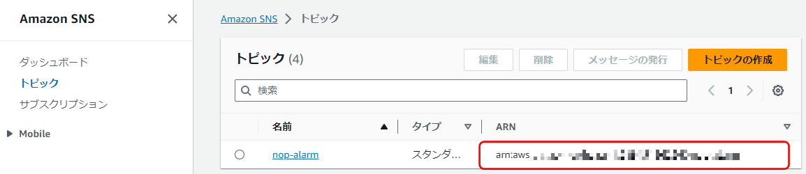

シェルスクリプトでOSの初期設定～アプリのインストール
================================================================

ここでは、サーバが起動している前提で、OSの初期設定～アプリのインストールまで行います。

※作業場所のディレクトリを「nop」とします(「nop」はCollaborageのコードネームです)。

- 多段SSHを使って、踏み台サーバ経由でスクリプトファイルを各EC2インスタンスにコピーします。そして、各EC2インスタンス内でシェルスクリプトを実行します。多段SSHは[このあたり](https://www.google.co.jp/search?q=%E5%A4%9A%E6%AE%B5ssh&oq=%E5%A4%9A%E6%AE%B5ssh&gs_l=psy-ab.3..0i71k1l4.0.0.0.3362.0.0.0.0.0.0.0.0..0.0....0...1..64.psy-ab..0.0.0.vBzx5nON7hY)を参照してください。
- 多段SSHを準備します。
  - SSHの接続設定を修正します。
    ```
    nop/.ssh/ssh.config
    ```
  - 作業場所で各EC2インスタンスにアクセスできることを確認します。
    ```
    $ ssh -F .ssh/ssh.config nop-bastion
    $ ssh -F .ssh/ssh.config nop-cq
    $ ssh -F .ssh/ssh.config nop-ci
    $ ssh -F .ssh/ssh.config nop-demo
    ```
- シェルスクリプトのパラメータを修正します。
    ```
    nop/script/config/params.config
    ```
  - SNSで作成済みのトピックのARNが必要になります。
    - AWSマネジメントコンソールでSNSにアクセスし、トピックのARNを確認します。
      - 
- docker-composeの定義を変更します。アプリで画面から設定できないため、事前に定義ファイルに指定します。
  - Rocket.Chatの外部URLを指定します。
    ```
    nop/docker/cq/docker-compose.yml
    ```
    - 「rocketchat」＞「environment」＞「ROOT_URL」に指定します。
      ```
      rocketchat:
        container_name: rocketchat
        # 省略
        environment:
          # 省略
          ROOT_URL: <ブラウザからrocketchatにアクセスする場合のURL>
      ```
    - Rocket.ChatのURLは「<ホスト>/rocketchat」となります。設定例を示します。
      ```
      ROOT_URL: https://nop-cq.adc-tis.com/rocketchat/
      ```
  - GitLabを使用する場合は、GitLabの外部URLを指定します。
    ```
    nop/docker/ci/docker-compose.yml
    ```
    - 「gitlab」＞「environment」＞「GITLAB_OMNIBUS_CONFIG」＞「external_url」に指定します。
      ```
      gitlab:
        container_name: gitlab
        # 省略
        environment:
          GITLAB_OMNIBUS_CONFIG: |
            external_url '<ブラウザからGitLabにアクセスする場合のURL>'
            gitlab_rails['time_zone'] = 'Tokyo'
            gitlab_rails['db_adapter'] = 'postgresql'
      ```
    - GitLabのURLは「<ホスト>/gitlab」となります。設定例を示します。
      ```
      external_url 'https://nop-ci.adc-tis.com/gitlab/'
      ```
- 準備が出来ました。インストールします。
  ```
  $ ./install.sh
  # install started
     :
    省略
     :
  # install completed
  $ 
  ```
  - 「# install completed」と表示されて実行が終了すればインストール完了です。

アプリのインストールは終わりです。
