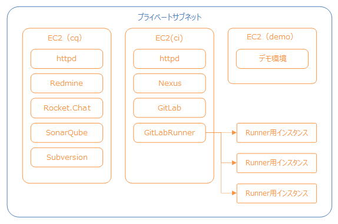

GitLab RunnerのAutoscaling
================================

ここでは、[GitLab Runnerの機能であるAutoscaling](https://docs.gitlab.com/runner/configuration/runner_autoscale_aws/)の利用設定を行います。

# GitLab RunnerのAutoscaling とは？
docker-machine を使って、必要に応じてパイプライン実行用のEC2インスタンスの作成・パイプラインの実行が終わったEC2インスタンスの削除を自動的に行います。  
EC2インスタンスの作成・削除の制御はGitLab Runnerが行います。  


ここでの作業内容は次の通りです。
- Collaborage1.1環境をご利用の場合に実施する作業
  - [GitLabのバージョンアップをします](#GitLabのバージョンアップをします)
- プロキシ環境下の場合に実施する作業
  - [AutoScaling用のAMIを作成します](#AutoScaling用のAMIを作成します)
  - [GitLab Runnerのプロキシの設定を修正します](#GitLab-Runnerのプロキシの設定を修正します)
  - [docker.serviceを修正します](#dockerserviceを修正します)
- [Runner実行用のユーザーを作成します](#Runner実行用のユーザーを作成します)
- [サーバのポートを開放します](#サーバのポートを開放します)
- [config.tomlを修正します](#configtomlを修正します)

# Collaborage1.1環境をご利用の場合
## GitLabのバージョンアップをします
Autoscalingのプロパティ`--amazonec2-security-group-readonly`はgitlab-runner:ubuntu-v12.5.0、環境変数NO_PROXYのブロック指定ははgitlab-runner:ubuntu-v12.6.0から利用可能となるため、12.6以降のバージョンに更新します。
- docker-compose.ymlを編集します。
  ```
  $ vi ~/nop/docker/ci/docker-compose.yml
  ```
  - GitLab、GitLab Runnerのバージョンを変更します。
    - 設定例
      ```
      gitlab:
        container_name: gitlab
        #image: gitlab/gitlab-ce:12.4.2-ce.0
        image: gitlab/gitlab-ce:12.6.8-ce.0
      （略）
      gitlab-runner:
        container_name: gitlab-runner
        #image: gitlab/gitlab-runner:ubuntu-v12.4.1
        image: gitlab/gitlab-runner:ubuntu-v12.6.0
      ```
- アプリを作り直します。
  - アプリを操作するディレクトリに移動します。
    ```
    $ cd ~/nop/docker/ci/
    ```
  - アプリを停止して削除します。
    ```
    $ docker compose down
    ```
  - アプリを作成して起動します。
    ```
    $ docker compose up -d
    ```
  - 起動時にマイグレーションが自動的に実行されるので、完了するまで待ちます。

# プロキシ環境下の場合
プロキシ環境下の場合は下記の作業を実施してください。

## Autoscaling用のAMIを作成します
- プロキシ環境下の場合は、Autoscaling用のAMIの設定を変更します。
  - Autoscalingに利用するインスタンスのAMIは任意のものを指定可能です。  
    プロキシ環境下ではAMIに対してプロキシの設定が必要なため、事前に設定を行ったAMIを準備しておきます。
- 以下はubuntu20.04を利用する場合のAMI設定例です。  
  ここでの作業内容は次の通りです。
  - [ubuntu20.04のAMIを使ってインスタンスを作成します](#ubuntu2004のAMIを使ってインスタンスを作成します)
  - [パッケージ管理のプロキシの設定を変更します](#パッケージ管理のプロキシの設定を変更します)
  - [環境変数にプロキシ設定を追加します](#環境変数にプロキシ設定を追加します)
  - [Dockerをインストールします](#Dockerをインストールします)
  - [Dockerにプロキシを設定します](#Dockerにプロキシを設定します)

### ubuntu20.04のAMIを使ってインスタンスを作成します
- 以下の設定でインスタンスを作成します。
  - 名前: nop-ec2-gitlab-runner
  - AMI: ami-0a3eb6ca097b78895 （ubuntu20.04）
  - インスタンスタイプ: t2.micro
  - その他の設定は他のインスタンスと同様となるように設定してください。

### パッケージ管理のプロキシの設定を変更します
- 作成したインスタンスにSSHで接続します。
- apt-getのproxy設定を追加します。
  ```
  $ sudo sh -c 'echo "Acquire::http::Proxy \"http://<プロキシサーバのIP>:<ポート番号>/\";" >> /etc/apt/apt.conf'
  $ sudo sh -c 'echo "Acquire::https::Proxy \"http://<プロキシサーバのIP>:<ポート番号>/\";" >> /etc/apt/apt.conf'
  ```
  - 設定例
    ```
    $ sudo sh -c 'echo "Acquire::http::Proxy \"http://192.0.2.1:3128/\";" >> /etc/apt/apt.conf'
    $ sudo sh -c 'echo "Acquire::https::Proxy \"http://192.0.2.1:3128/\";" >> /etc/apt/apt.conf'
    ```

### 環境変数にプロキシ設定を追加します
- .profileにプロキシ設定を追加します。
  ```
  $ vi ~/.profile
  ```
  - プロキシの設定を追加します。
    ```
    export HTTP_PROXY=http://<プロキシサーバのIP>:<ポート番号>
    export HTTPS_PROXY=http://<プロキシサーバのIP>:<ポート番号>
    export http_proxy=http://<プロキシサーバのIP>:<ポート番号>
    export https_proxy=http://<プロキシサーバのIP>:<ポート番号>
    ```
    - 設定例
      ```
      export HTTP_PROXY=http://192.0.2.1:3128
      export HTTPS_PROXY=http://192.0.2.1:3128
      export http_proxy=http://192.0.2.1:3128
      export https_proxy=http://192.0.2.1:3128
      ```
- 設定を反映します。
  ```
  $ source ~/.profile
  ```

### Dockerをインストールします
- Dockerをインストールします。
  ```
  $ sudo apt-get update
  $ sudo apt-get install
  $ sudo mkdir -p /etc/apt/keyrings
  $ curl -fsSL https://download.docker.com/linux/ubuntu/gpg | sudo gpg --dearmor -o /etc/apt/keyrings/docker.gpg
  $ echo \
    "deb [arch=$(dpkg --print-architecture) signed-by=/etc/apt/keyrings/docker.gpg] https://download.docker.com/linux/ubuntu \
    $(lsb_release -cs) stable" | sudo tee /etc/apt/sources.list.d/docker.list > /dev/null
  $ sudo apt-get update
  $ sudo apt-get install docker-ce docker-ce-cli containerd.io docker-compose-plugin
  ```

### Dockerにプロキシを設定します
- Dockerにプロキシを設定します。
  ```
  $ sudo cp /usr/lib/systemd/system/docker.service /etc/systemd/system
  $ sudo vi /etc/systemd/system/docker.service
  ```
  - ExecStartコマンドの直前にPROXYの設定を追加します。
    ```
    Environment="HTTP_PROXY=http://<プロキシサーバのIP>:<ポート番号>"
    Environment="HTTPS_PROXY=http://<プロキシサーバのIP>:<ポート番号>"
    Environment="NO_PROXY=<CIサーバーのIP>"
    ```
    - 設定例
      ```
      Environment="HTTP_PROXY=http://192.0.2.1:3128"
      Environment="HTTPS_PROXY=http://192.0.2.1:3128"
      Environment="NO_PROXY=192.0.2.3"
      ```
- 設定の再読込とDockerの再起動を行います。
  ```
  $ sudo systemctl daemon-reload
  $ sudo systemctl restart docker
  ```
### AMIを作成します
- 出来上がったインスタンスをもとにプロキシ設定がされたAMIを保存します。
  - AMIの保存方法は[アプリの復元](aws.md#アプリの復元)を参照して作業します。

## GitLab Runnerのプロキシの設定を修正します
- プロキシ環境下の場合は、GitLab Runnerのプロキシの設定を変更します。
  - アプリを操作するディレクトリに移動します。
    ```
    $ cd ~/nop/docker/ci/
    ```
  - docker-compose.ymlを修正します。
    ```
    $ vi ~/nop/docker/ci/docker-compose.yml
    ```
    - GitLab Runnerにenv_file、environmentの設定を追加します。
      ```
      gitlab-runner:
        container_name: gitlab-runner
        image: gitlab/gitlab-runner:ubuntu-v12.4.1
        restart: always
        env_file: ./common.env
        environment:
          NO_PROXY: <同一サブネットのIP範囲>
      ```

      - 設定例
        ```
        gitlab-runner:
          container_name: gitlab-runner
          image: gitlab/gitlab-runner:ubuntu-v12.4.1
          restart: always
          env_file: ./common.env
          environment:
            NO_PROXY: 192.0.0.0/16
        ```
  - アプリを作り直します。
    - アプリを操作するディレクトリに移動します。
      ```
      $ cd ~/nop/docker/ci/
      ```
    - アプリを停止して削除します。
      ```
      $ docker compose down
      ```
    - アプリを作成して起動します。
      ```
      $ docker compose up -d
      ```

## docker.serviceを修正します
- プロキシ環境下の場合は、GitLab Runnerのプロキシの設定を変更します
  - Dockerのプロキシの設定を変更します。
    ```
    $ sudo vi /etc/systemd/system/docker.service
    ```
    - ExecStartコマンドの直前にNO_PROXYの設定を追加します。
    ```
    Environment="NO_PROXY=<CIサーバーのIP>"
    ```
    - 設定例
      ```
      Environment="HTTP_PROXY=http://192.0.2.1:3128"
      Environment="NO_PROXY=192.0.2.3"
      ```
  - 設定の再読込とDockerの再起動を行います。
    ```
    $ sudo systemctl daemon-reload
    $ sudo systemctl restart docker
    ```

# Runner実行用のユーザーを作成します
- EC2でインスタンスの起動＋終了が可能なユーザーを作成します。
- アクセスキーを作成します。
  - IAMでユーザーを選択します。
  - 「セキリュティ認証情報」タブを選択します。
  - 「アクセスキー」の「アクセスキーを作成」を選択します。
  - 「主要なベストプラクティスと代替案にアクセスする」を設定します。
    - 「サードパーティーサービス」を選択
    - 「上記のレコメンデーションを理解し、アクセスキーを作成します。」をチェック
    - 「次へ」を選択します。
  - 「説明タグを設定」を設定します。
    - 「アクセスキーを作成」を選択します。
  - アクセスキーとシークレットアクセスキーが作成されるので控えておきます。

# サーバのポートを開放します
- 各ポートが開放済の場合は対応不要です。
- CIサーバの開放ポート
  - 19081
    - CIサーバのnexusからdockerイメージ取得する際に利用します。
    - Autoscalingで起動されたインスタンスからCIサーバへの接続が可能となるように設定します。
- Autoscalingで起動されたインスタンスの開放ポート
  - 2376
    - CIサーバのGitLab RunnerとAutoscalingで起動されたインスタンスの通信に利用します。
    - CIサーバからAutoscalingで起動されたインスタンスへの接続が可能となるように設定します。
  - 22
    - CIサーバのGitLab RunnerとAutoscalingで起動されたインスタンスの通信に利用します。
    - CIサーバからAutoscalingで起動されたインスタンスへの接続が可能となるように設定します。

# config.tomlを修正します
- Autoscalingを有効にするため、config.toml を修正します。
  ```
  $ sudo vi /data/gitlab-runner/config/config.toml
  ```
  - 以下の値を変更します。
    - concurrent:同時に実行するジョブ数です。2以上に変更します。
      - この設定値はconfig-tomlで定義された全てのrunnerが同時実行された場合の最大値です。  
        - 設定例
          ~~~
          concurrent = 3
          ~~~
    - [[runners]] 
      - executor: `docker`→`docker+machine`に変更します。
  - 下記の項目を[runners.cache]ブロックの後に追加します。
    ```
    [runners.machine]
      IdleCount = 0
      IdleTime = 1800
      MaxBuilds = 100
      MachineDriver = "amazonec2"
      MachineName = "gitlab-docker-machine-%s"
      MachineOptions = [
        "amazonec2-access-key=<取得したアクセスキー>",
        "amazonec2-secret-key=<取得したシークレットアクセスキー>",
        "amazonec2-ami=<利用するAMIのID>",
        "amazonec2-instance-type=t2.micro",
        "amazonec2-region=<collaborage環境のregion>",
        "amazonec2-zone=<collaborage環境のregion>",
        "amazonec2-vpc-id=<collaborage環境のVPCのID>",
        "amazonec2-subnet-id=<collaborage環境のsubnetのID>",
        "amazonec2-use-private-address=true",
        "amazonec2-tags=runner-manager-name,gitlab-aws-autoscaler,gitlab,true,gitlab-runner-autoscale,true",
        "amazonec2-security-group=<collaborage環境のセキュリティグループ名>",
        "amazonec2-security-group-readonly=true",
        "amazonec2-iam-instance-profile=<collaborage環境のロール名>",
        "amazonec2-request-spot-instance=true",
        "engine-insecure-registry=<CIサーバのIP>:19081",
    ]
    ```
    - 各項目の簡単な解説
      - IdleCount: 常にアイドル状態にしておくインスタンス数
      - IdleTime: インスタンス削除までの秒数
      - MaxBuilds: 1インスタンスで実行できるジョブの実行上限数
      - MachineName: インスタンス名のフォーマット※%s（インスタンスのID）が必須
      - MachineOptions: インスタンス詳細設定
        - amazonec2-tags: インスタンスに設定するタグ（key1,value1,key2,value2形式）
        - amazonec2-ami: 
          - Autoscalingに利用するインスタンスのAMIは任意のものを指定可能なため、利用するAMIのIDを設定します。
            - 未設定の場合はGitLab RunnerのデフォルトのAMIが設定されますが、2023年9月時点では起動時にエラーが発生するため特定のAMIを設定してください。
              - 動作検証は ubuntu 20.04（ami-0a3eb6ca097b78895）のAMIを利用して行っているため、このAMIの利用を推奨します。
            - プロキシ環境では作成したAMIのIDを設定します。
        - amazonec2-security-group-readonly:
          - セキュリティグループの上書き設定です。
          - 未設定の場合セキュリティグループの上書きを行ってしまうので、必ずtrueを設定してください。
        - amazonec2-request-spot-instance: スポットインスタンスの利用設定
        - engine-insecure-registry: Nexus.Repositoryからdockerイメージをpullする際httpsから除外するIPを設定
    - 設定例
      - 以下の項目は各環境にあわせて読み替えてください。
        - ACCESS_KEY
        - SECRET_KEY
        - VPC_ID
        - SUBNET_ID,
        - SECURITY_GROUP_NAME
        - ROLE_NAME
      ```
      （略）
      [runners.cache]
        [runners.cache.s3]
        [runners.cache.gcs]
      [runners.machine]
        IdleCount = 0
        IdleTime = 1800
        MaxBuilds = 100
        MachineDriver = "amazonec2"
        MachineName = "gitlab-docker-machine-%s"
        MachineOptions = [
          "amazonec2-access-key=ACCESS_KEY",
          "amazonec2-secret-key=SECRET_KEY",
          "amazonec2-ami=ami-0a3eb6ca097b78895",
          "amazonec2-instance-type=t2.micro",
          "amazonec2-region=ap-northeast-1",
          "amazonec2-zone=a",
          "amazonec2-vpc-id=VPC_ID",
          "amazonec2-subnet-id=SUBNER_ID",
          "amazonec2-use-private-address=true",
          "amazonec2-tags=runner-manager-name,gitlab-aws-autoscaler,gitlab,true,gitlab-runner-autoscale,true",
          "amazonec2-security-group=SECURITY_GROUP_NAME",
          "amazonec2-iam-instance-profile=ROLE_NAME",
          "amazonec2-security-group-readonly=true",
          "amazonec2-request-spot-instance=true",
          "engine-insecure-registry=192.0.2.3:19081",
        ]
      ```
- アプリを作り直します。
  - アプリを操作するディレクトリに移動します。
    ```
    $ cd ~/nop/docker/ci/
    ```
  - アプリを停止して削除します。
    ```
    $ docker compose down
    ```
  - アプリを作成して起動します。
    ```
    $ docker compose up -d
    ```

## 動作確認をします
- GitLabにログインし、プロジェクトの「CI/CD」＞「pipeline」からパイプラインを実行し、成功することを確認します。
- EC2コンソールのインスタンス一覧にインスタンスが追加されていることを確認します。
