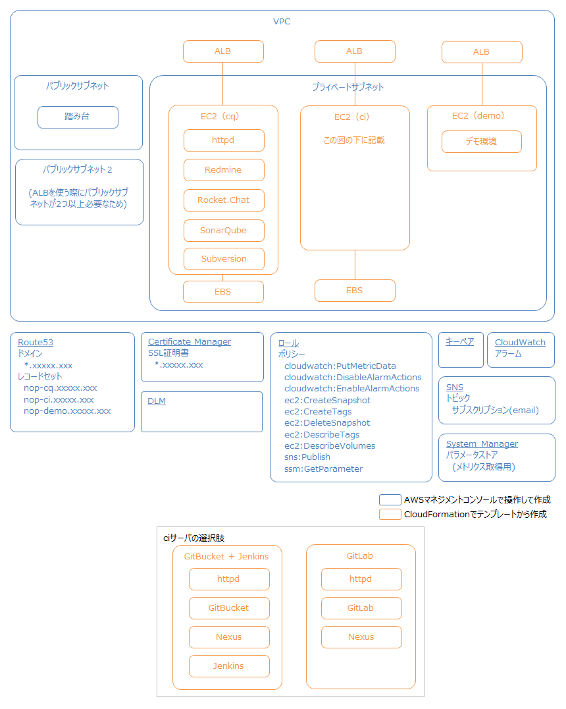
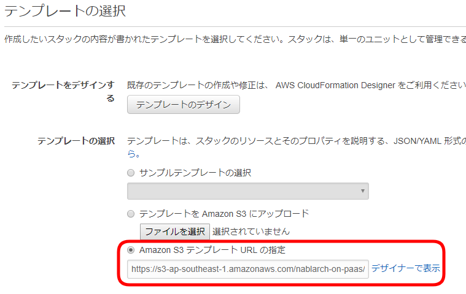
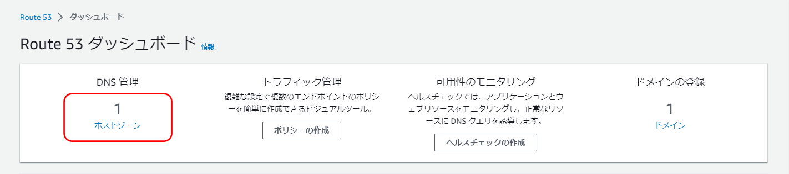
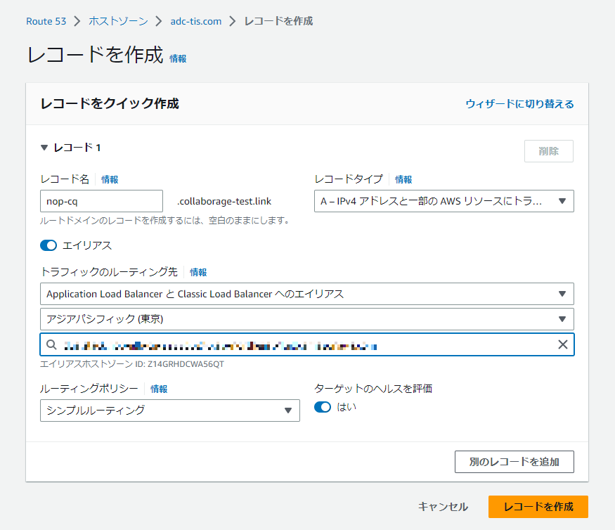

AWS
================================
ここではAWSにチーム開発環境を構築します。
はじめに「アーキテクチャ」に軽く目を通して作成内容を確認してから、「事前準備」「インストール」に進みます。

Collaborage 1.0.0をお使いの方で、アプリケーションのビルドにJava11を使用したい方は、「マイグレーション」に進んでください。

- [アーキテクチャ](#アーキテクチャ)
- [事前準備](#事前準備)
- [インストール](#インストール)
- [オペレーション](#オペレーション)
- [マイグレーション](#マイグレーション)


## アーキテクチャ





### アプリの配置


- 3つのインスタンスにアプリを配置します。
  - CQ(Communication/Quality)サーバ
  - CI(Continuous Integration)サーバ
  - Demoサーバ
- CQ/CIサーバのEC2はm4.large、ルートボリューム20GB、データボリューム40GBでデフォルト提供します。
- Demoサーバはt2.small、ルートボリューム20GBでデフォルト提供します。
- GitLabを使う場合は、GitLabがリソースを消費するため、CIサーバのEC2のみ、m4.xlarge、ルートボリューム40GB、データボリューム40GBでデフォルト提供します。
- **上記のマシンスペックは推奨する最低限のスペックになります。PJの規模に合わせて変更してください。**


### HTTPSによる通信


- 開発拠点からインターネットを経由してAWSにアクセスするため、ALBを設けてHTTPSを使用します。
- HTTPSに必要なドメイン、SSL証明書は事前に準備します。


### バックアップ


- CQ/CIサーバのアプリデータのみバックアップを取得します。（CIにより復元できるためDemoサーバのアプリデータは取得しません）
- EBSのスナップショットをバックアップとします。
- CQ/CIサーバの/dataをEBSにマウントし、アプリのデータを/data/<アプリ名\>に格納します。
- Amazon DLMを定期実行し、EBSのスナップショットを取得します。
  - スナップショット取得
    - Amazon DLMにて取得します。
    - **スナップショットの取得対象は、NopDataDlmTargetタグに「true」が設定されているEBSとなります。**

### 監視


- CQ/CIサーバのディスク使用率のみ監視します。（Demoサーバは監視しません）
- CQ/CIサーバのcronでシェルスクリプトを定期実行し、メトリクス(ディスク使用率)をCloudWatchに送信します。
- デフォルトは5分間隔で送信します。
- シェルスクリプトでは、[Amazon CloudWatch モニタリングスクリプト](http://aws.amazon.com/code/8720044071969977)を使って、メトリクスをCloudWatchに送信します。
  - メトリクス取得の詳細は、[Amazon EC2 Linux インスタンスのメモリとディスクのメトリクスのモニタリング](http://docs.aws.amazon.com/ja_jp/AWSEC2/latest/UserGuide/mon-scripts.html)を参照してください。
  - どこかの処理で失敗すると、AWS CLIを使ってSNSのトピックにメッセージを発行します。
    - SNSのトピックにサブスクリプションとしてemailを設定しておくことで、メール通知を実現します。
- CloudWatchでアラーム及びルールを手動で設定し、以下の場合にメール送信（SNS経由）します。
  - ディスク使用率が80%を超えた場合
  - EBSのスナップショットの取得に失敗した場合


## 事前準備


### AWS

- AWSマネジメントコンソールにアクセスし、図にあるリソースを作成します。
  - 
- 既にある環境にインストールする場合は足りないリソースのみ作成します。
- ネットワーク構成は[パブリックサブネットとプライベートサブネットを持つ VPC (NAT)](http://docs.aws.amazon.com/ja_jp/AmazonVPC/latest/UserGuide/VPC_Scenario2.html)を参照してください。
- 各リソースの作成方法はAWSのドキュメントを参照するか、AWS有識者に相談してください。30分～1時間で作成できると思います。
- トピックにはemailのサブスクリプションも作成します。
- ポリシーの作成は以下のjsonを使用してください。
  ```
  {
    "Version": "2012-10-17",
    "Statement": [
      {
        "Sid": "Stmt1504604285000",
        "Effect": "Allow",
        "Action": [
          "sts:AssumeRole",
          "cloudwatch:PutMetricData",
          "ec2:CreateSnapshot",
          "ec2:CreateSnapshots",
          "ec2:CreateTags",
          "ec2:DeleteSnapshot",
          "ec2:DescribeTags",
          "ec2:DescribeInstances",
          "ec2:DescribeVolumes",
          "ec2:DescribeSnapshots",
          "ec2:EnableFastSnapshotRestores",
          "ec2:DescribeFastSnapshotRestores",
          "ec2:DisableFastSnapshotRestores",
          "ec2:CopySnapshot",
          "sns:Publish"
        ],
        "Resource": [
          "*"
        ]
      }
    ]
  }
  ```
- ロールの信頼されたエンティティに以下を指定してください。
  - ec2.amazonaws.com
  - dlm.amazonaws.com

  設定には以下のjsonを使用してください。
  ```
  {
    "Version": "2012-10-17",
    "Statement": [
      {
        "Effect": "Allow",
        "Principal": {
          "Service": [
            "ec2.amazonaws.com",
            "dlm.amazonaws.com"
          ]
        },
        "Action": "sts:AssumeRole"
      }
    ]
  }
  ```
- インストールにはCollaborageが提供するAMIを使用します。AMIはパブリックイメージとして公開しています。
  - CQサーバ： nop-dev-cq-0.2.2
  - CIサーバ(GitBucket/Jenkins)： nop-dev-ci-jenkins-0.2.3
  - CIサーバ(GitLab)： nop-dev-ci-gitlab-0.2.3
  - Demoサーバ： nop-inst-demo-0.1.4

### 作業PC

- gitコマンド/sshコマンドを使えるようにします。
  - Windowsであれば[Git for Windows](https://git-for-windows.github.io/)をインストールすれば、Git BASHを使用してgitコマンド/sshコマンドを使えます。
  - インストール方法は[このあたり](https://www.google.co.jp/search?q=git+for+windows+%E3%82%A4%E3%83%B3%E3%82%B9%E3%83%88%E3%83%BC%E3%83%AB&oq=Git+for+Windows%E3%80%80&gs_l=psy-ab.1.0.0l8.3848.3848.0.5856.1.1.0.0.0.0.139.139.0j1.1.0....0...1.4.64.psy-ab..0.1.138.7Ht2O-5L3YM)を参考にしてください。
  - 古いGit BASHを使用していると、ssh経由でコマンドを実行した際にエラーが発生することがあります。現行バージョンをインストールすることをお勧めします。
- sshコマンドで踏み台サーバにアクセスします。
  - アクセス方法は[このあたり](https://www.google.co.jp/search?q=aws+ec2+ssh+%E8%B8%8F%E3%81%BF%E5%8F%B0&oq=aws+ec2+ssh&gs_l=psy-ab.1.2.0l8.19285.21173.0.23904.7.7.0.0.0.0.140.668.0j5.5.0....0...1.1.64.psy-ab..2.5.667...0i131k1.HfnC6xbuzC4)を参考にしてください。


## インストール


インストールは次の手順で行います。

- [作業場所を準備します](#作業場所を準備します)
- [CloudFormationでAWSリソース（EC2など）を作成します](#cloudformationでawsリソースec2などを作成します)
- [SSHを準備します](#sshを準備します)
- [Route53でサブドメインを追加して、各アプリにアクセスできるようにします](#route53でサブドメインを追加して各アプリにアクセスできるようにします)
- [AMIから作成したEC2インスタンスの初期設定を行います](#amiから作成したec2インスタンスの初期設定を行います)


### 作業場所を準備します


- Collaborageをクローンします。
  ```
  $ git clone https://github.com/Fintan-contents/collaborage.git
  $ cd collaborage
  ```
- 作業場所を作成します。作業場所のディレクトリ、CIツール(GitBucket/Jenkins or GitLab)を決めてください。特に希望がなければ、情報が多く、リソース消費が少ない(つまり低コスト)、Jenkinsを使い、コードレビューをGitリポジトリ上で行いたい場合はGitLabを使うと指摘の管理が楽になります。
  - ユーザのnopディレクトリにJenkinsで作る場合
    ```
    $ ./init-workplace.sh ~/nop aws jenkins
    $ cd ~/nop
    ```
  - ユーザのnopディレクトリにGitLabで作る場合
    ```
    $ ./init-workplace.sh ~/nop aws gitlab
    $ cd ~/nop
    ```


### CloudFormationでAWSリソース（EC2など）を作成します


- AWSマネジメントコンソールにアクセスします。
- S3にアクセスし、テンプレートファイルをアップロードします。バケットが無ければ、新しくバケットを作成します。
  - Jenkinsを使う場合
    ```
    nop/template/nop-with-ssl-jenkins.yaml
    ```
  - GitLabを使う場合
    ```
    nop/template/nop-with-ssl-gitlab.yaml
    ```
  - アップロードの後、テンプレートファイルを選択し、リンクをコピーします。
    - 
- CloudFormationにアクセスし、スタックを作成します。
  - 「新しいスタックの作成」を選択します。
  - アップロードしたテンプレートファイルを選択します。
    - 
  - パラメータを設定します。リソース関連は事前準備で作成したものを指定します。
    - スタックの名前
      - 「nop」と入力します。
    - BastionSecurityGroup
      - 踏み台サーバのセキュリティグループを選びます。
    - Ec2KeyPair
      - EC2に割り当てるキーペアを選びます。
    - Ec2Role
      - EC2に割り当てるロールの名前を指定します。
      - IAMにアクセスし、ロールの名前を確認します。
        - 
    - Ec2TypeForCi
      - CIサーバのインスタンスタイプを指定します。
      - Jenkinsを使う場合は「m4.large」、GitLabを使う場合は「m4.xlarge」ぐらいあれば大丈夫だと思います。
    - Ec2TypeForCq
      - Communication/Qualityサーバのインスタンスタイプを指定します。
      - 「m4.large」ぐらいあれば大丈夫だと思います。
    - Ec2TypeForDemo
      - Demoサーバのインスタンスタイプを指定します。
      - PJの要件(APサーバやDBサーバ等)に合わせて指定してください。
    - PrivateSubnet
      - プライベートサブネットを選びます。
    - PublicSubnets
      - パブリックサブネットを選びます。
      - **ALBを使用するため、パブリックサブネットを2つ選んでください。**
    - SourceIp
      - 開発環境へのアクセス元となるソースIPのCIDRを指定します。
    - SslCertificate
      - SSL証明書のARNを指定します。
      - Certificate Managerにアクセスし、証明書を選択し、証明書のARNを確認します。
        - 
    - Vpc
      - VPCを選択します。
  - 以降は「次へ」を選択し、作成します。大体3分ぐらいで完了します。
    - 状況がPROGRESSからCOMPLETEになれば作成完了です。右上の更新ボタンで表示を更新できます。
      - PROGRESS
        - 
      - COMPLETE
        - 
    - EC2インスタンスはすぐに作成中の状態になり、プライベートIPが割り当てられるので、待っている間に次の手順にあるSSHの準備をします。
      - EC2にアクセスし、各EC2インスタンスを選択して、プライベートIPを確認します。
        - 


### SSHを準備します


- 多段SSHを使って、踏み台サーバ経由で各EC2インスタンスにアクセスします。
- 多段SSHは[このあたり](https://www.google.co.jp/search?q=%E5%A4%9A%E6%AE%B5ssh&oq=%E5%A4%9A%E6%AE%B5ssh&gs_l=psy-ab.3..0i71k1l4.0.0.0.3362.0.0.0.0.0.0.0.0..0.0....0...1..64.psy-ab..0.0.0.vBzx5nON7hY)を参照ください。
- SSHの接続情報はconfigファイルに定義しておき、configファイルとホスト名を指定するだけでSSH接続できるようにします。
- SSHの接続設定を修正します。
  ```
  nop/.ssh/ssh.config
  ```
  - 踏み台サーバとEC2インスタンスのキーペアファイルを.sshにコピーします。
  - プライベートIP、キーペアファイルへのパス、踏み台サーバのユーザ名を指定します。
- 作業場所で各EC2インスタンスにアクセスできることを確認します。
  ```
  $ ssh -F .ssh/ssh.config nop-bastion
  $ ssh -F .ssh/ssh.config nop-cq
  $ ssh -F .ssh/ssh.config nop-ci
  $ ssh -F .ssh/ssh.config nop-demo
  ```


### Route53でサブドメインを追加して、各アプリにアクセスできるようにします


- Route 53にアクセスし、レコードセットを追加します。
  - ここでは、例として「adc-tis.com」というドメインへ追加しています。
  - 「Hosted zones」を選択します。
    - 
  - 「Domain Name」のリンクを選択します。
    - 
  - レコードセットを追加します。
    - 
    - Name:
      - サブドメインの名前を指定します。
      - ここで指定した名前が各EC2インスタンスへアクセスする際のホストになります。
      - アクセス先となるEC2インスタンスの用途（CQ、CI、Demo）に合わせた名前を指定します。
    - Type:
      - IPv4のままです。
    - Alias:
      - Yesを選択します。
    - Alias Target:
      - EC2インスタンスの用途（CQ、CI、Demo）に合わせたALBを選びます。
      - ALBの名前は「nop-alb-(cq|ci|demo)-xxxxx」で作成しています。
      - フォーカスを合わせて入力欄を空にすると、存在しているALBがプルダウンにロードされます。
    - 以降の項目はデフォルトのままでCreateします。
    - EC2インスタンスごとにレコードセットを追加します。
- ブラウザを開いて各EC2インスタンスのアプリにアクセスできることを確認します。
  ```
  CQサーバ
  https://<CQサーバのホスト>/redmine

  CIサーバ
  https://<CIサーバのホスト>/nexus
  
  Demoサーバ
  アプリをデプロイしていないので、この時点ではアクセスできません。
  ```
  - アクセスできない場合は以下を確認してください。
    - ブラウザは、`https://` から始まるURLを表示しようとしていますか？ `https://` と入力したはずなのに、 `http://` から始まるURLを表示しようとしていることがあります。
    - Route53について以下を確認してください。
      - 以前使ったサブドメインの名前を使ってませんか？使ったばかりの名前を再利用した場合、アクセスできるようになるまで時間が掛かるかもしれません。
      - レコードセットを追加した際のALBの名前は、間違っていませんか？
    - AWSの以下のサービスは稼働していますか？ https://status.aws.amazon.com/ から確認してください。
      - Amazon Elastic Load Balancing
      - Amazon Elastic Compute Cloud
      - Amazon Route 53
  - これらを確認して問題が無かった場合、ALBやRoute 53が使用可能になるまで、まだ時間が掛かるのかもしれません。10分程度時間おいてから、表示できるか試してください。


### AMIから作成したEC2インスタンスの初期設定を行います


- [こちら](ami.md)を参照して作業します。

これでインストールは終わりです！
お疲れさまでした。

プロジェクト向けの開発準備は[プロジェクトの開発準備](dev.md)を参照して作業してください。


## オペレーション


- [アプリの操作方法（起動/停止/ログ確認）](#アプリの操作方法起動停止ログ確認)
- [アプリの復元方法（アプリ/アプリデータ）](#アプリの復元方法アプリアプリデータ)
- [アプリデータの復元方法](#アプリデータの復元方法)
- [バックアップとメトリクス取得が失敗した場合のログの確認方法](#バックアップとメトリクス取得が失敗した場合のログの確認方法)
- [アプリのバージョンアップ方法](#アプリのバージョンアップ方法)


### アプリの操作方法（起動/停止/ログ確認）


CQサーバ/CIサーバのアプリはdocker-composeを使って起動しています。
アプリの操作はSSHでアクセスして、docker-composeのコマンドで行います。

docker-composeのコマンドは[コマンドリファレンス](http://docs.docker.jp/compose/reference/toc.html)を見てください。

CQサーバ/CIサーバのアプリを操作する場所は次の通りです。

- CQサーバ
  ```
  /home/centos/nop/docker/cq
  ```
- CIサーバ
  ```
  /home/centos/nop/docker/ci
  ```

#### アプリの起動

```
$ docker-compose start
```

#### アプリの停止

```
$ docker-compose stop
```

#### アプリの一覧表示

```
$ docker-compose ps
```
- Name列にサービス名が表示されます。

#### アプリのログ確認

```
$ docker-compose logs <サービス名>
```
- 「docker-compose ps」コマンドでサービス名を確認します。


### アプリの復元方法(アプリ/アプリデータ)


#### アプリの復元

アプリの復元は、インストール時に作成しておいたAMIを使って行います。

- CQサーバ/CIサーバの場合は、アプリデータのバックアップを取得します。
  - AWSマネジメントコンソールで「EC2」にアクセスします。
  - CQサーバ/CIサーバのインスタンスを選択＞「アクション」＞「インスタンスの状態」＞「停止」を選択します。  
  - 停止するまで待ちます。
  - 「ボリューム」＞CQサーバ/CIサーバのEBSを選択＞「アクション」＞「スナップショットの作成」を選択します。  
    - 「クリックして Name タグを追加します」のリンクをクリックして、任意の名前を付けます。  
      (名前を付けておかないと、後でスナップショットからボリュームを作成する際にスナップショットの区別がつかなくて、困ります)
    - 「スナップショットの作成」をクリックします。
  - 「スナップショット」をクリックします。
  - 先ほど作成したスナップショットが「completed」の状態で表示されるまで待ちます。
- 不要となったEC2インスタンスを削除します
  - AWSマネジメントコンソールで「EC2」にアクセスし、インスタンスを選択＞「アクション」＞「インスタンスの状態」＞「削除」を選択します。
- AMIからEC2インスタンスを復元します。
  - EC2インスタンスのプライベートIPを確認します。
    - 作業PCの作業場所にあるSSHの接続情報(.sshディレクトリのconfigファイル)を見てプライベートIPを確認します。
  - 「EC2」＞「AMI」にアクセスし、AMIを選択＞「作成」を選択します。
    - ステップ 2: インスタンスタイプの選択
      - [アーキテクチャ](#アーキテクチャ)を参考にして選択します。
    - ステップ 3: インスタンスの詳細の設定
      - ネットワーク、サブネット、IAMロールを指定します。
      - ネットワークインタフェースの「プライマリIP」に先ほど確認したプライベートIPを指定します。
    - ステップ 4: ストレージの追加
      - 特に変更することはありません。
    - ステップ 5: タグの追加
      - 「クリックして Name タグを追加します 」を選択します。
        - 値に「nop-ec2-xx」を指定します。xxにはサーバの用途に合わせて「cq」「ci」「demo」のいずれかを指定します。
    - ステップ 6: セキュリティグループの設定
      - 「既存のセキュリティグループを選択する」を選択します。
        - 名前「nop-sg-ec2」を選択します。
    - 作成します。
- [アプリデータの復元](#アプリデータの復元方法)を行います。
- ALBから復元したEC2インスタンスにアクセスできるようにターゲットグループの設定を変更します。
  - AWSマネジメントコンソールで「EC2」＞「ターゲットグループ」にアクセスします。
  - サーバの用途に合わせて「nop-tg-cq」「nop-tg-ci」「nop-tg-demo」のいずれかを選択します。
  - 「ターゲット」タブ＞「編集」を選択します。
  - インスタンス選択＞「登録済みに追加」を選択し、保存します。
  - ブラウザからアプリにアクセスできることを確認します。
- CQサーバ/CIサーバの場合は、cron関連の設定作業を行います。
  - [データボリュームを定期的にバックアップするように設定します](ami.md#データボリュームを定期的にバックアップするように設定します)を参照して作業します。
  - SSHでサーバにアクセスします。
  - cronを削除します。
    ```
    $ crontab -r
    ```
  - AWS CLIのキャッシュ(インスタンスID)を削除します。
    ```
    $ sudo rm /var/tmp/aws-mon/instance-id
    ```
  - cronを設定します。
    ```
    $ cd ~/nop/script/
    $ ./set-cron-after-try-command.sh
    ```
    - AWSマネジメントコンソールで「CloudWatch」＞アラームにアクセスし、ディスク使用率のアラーム設定を変更します。
      - メトリクスを選択しなおします。


### アプリデータの復元方法


アプリデータの復元は、EBSのスナップショットを使って行います。

以下の手順で行います。
- スナップショットからボリュームを作成します。
- EC2インスタンスを停止します。
- EC2インスタンスの「/dev/sdb」デバイスにアタッチされているボリュームをデタッチします。
- EC2インスタンスの「/dev/sdb」デバイスにスナップショットから作成したボリュームをアタッチします。
- デタッチしたボリュームを削除します。


### バックアップとメトリクス取得が失敗した場合のログの確認方法


cronで実行しているバックアップとメトリクス取得が失敗した場合は、メールで通知されます。

SSHでサーバにアクセスし、エラーログの内容を確認してください。

CQサーバ/CIサーバともに、以下の場所にエラーログが出力されます。

```
/home/centos/nop/log/
```


### アプリのバージョンアップ方法

バージョンアップは以下の手順で行います。

1. 現在の使用しているDocker Imageのバージョンを調べる
2. アプリのリリースノート等を確認し、バージョンアップ時のデータ移行の手順、その他バージョンアップ時に必要な設定変更を調べる。
3. バージョンアップを行う

Collaborage固有のトピックである1と3について記載ます。

#### 現在のDocker Imageのバージョンを調べる
- docker-compose.ymlを開きます。
  - CQサーバの場合
    ```
    $ vi ~/nop/docker/cq/docker-compose.yml
    ```
  - CIサーバの場合
    ```
    $ vi ~/nop/docker/ci/docker-compose.yml
    ```
- バージョンアップしたいアプリの定義を参照してバージョンを調べるため、バージョンアップしたいアプリのimage要素またはcontext要素を探します。  
  image要素が記載されている場合は、その値にDocker Imageのバージョンが記載されています。  
  context要素が記載されている場合は、context要素に記載されているDockerFileを参照して調査します。
  それぞれの例を示します。
  - image要素が記載されている例  
    ```
    (中略)
    proxy:
      container_name: proxy
      image: httpd:2.2.34-alpine
    (中略)
    ```
    この場合は、2.2.34-alpineが使用しているバージョンです。
  - context要素が記載されている例
    ```
    (中略)
    jenkins:
      container_name: jenkins
      build:
        context: ./dockerfiles/jenkins
    (中略)
    ```
    この場合は、 `~/nop/docker/ci/dockerfiles/jenkins` ファイルのFROM要素を確認します。
    ```
    FROM jenkins/jenkins:2.190.3
    (中略)
    ```
    2.190.3が使用しているバージョンです。


#### アプリの削除とバックアップ取得を行う
アプリの停止を伴いますので、アプリを停止して差し支えないタイミングで行ってください。

- アプリを操作するディレクトリに移動します。
  - CQサーバの場合
    ```
    cd ~/nop/docker/cq/
    ```
  - CIサーバの場合
    ```
    cd ~/nop/docker/ci/
    ```

- アプリを停止して削除します。
  ```
  $ docker-compose down
  ```

- バージョンアップ失敗時に簡単に切り戻せるようにするため、以下のディレクトリのバックアップを取ってください。
  - `~/nop/docker`
  - `/data`

  以下に例を示します。 
  ```
  $ cp -r ~/nop/docker ~/nop/docker-bak
  $ sudo cp -r /data /data-bak
  ```

#### バージョンアップを行う

- アプリを操作するディレクトリに移動します。
  - CQサーバの場合
    ```
    cd ~/nop/docker/cq/
    ```
  - CIサーバの場合
    ```
    cd ~/nop/docker/ci/
    ```


- 「現在のDocker Imageのバージョンを調べる」で確認したdocker-compose.yml、Dockerfileに記載されているバージョン番号を修正します。  
  例えば、jenkinsのバージョンを2.206に上げたい場合は、`~/nop/docker/ci/dockerfiles/jenkins` を以下のように修正します。
  ```
  FROM jenkins/jenkins:2.206
  (中略)
  ```
- バージョンアップ時に必要な設定変更がある場合は、 `docker-compose.yml` の修正、または `/data` ディレクトリに存在する各アプリのデータファイルを修正して対応します。
- Dockerfileを修正した場合は、イメージのビルドを行います。  
  ```
  $ docker-compose build --no-cache
  ```
- [CQサーバの設定を変更します](ami.md#cqサーバの設定を変更します) または、 [CIサーバの設定を変更します](ami.md#ciサーバの設定を変更します) の「アプリを作り直します」の手順を参照して、アプリを作り直します。
- バージョンアップしたアプリの動作確認を行います。

#### バックアップの削除を行う
- ディレクトリのバックアップを消します。
  以下に例を示します。 
  ```
  $ rm -rf  ~/nop/docker-bak
  $ sudo rm -rf  /data-bak
  ```


## マイグレーション

### Java 11対応アプリケーションへのバージョンアップ

#### CQサーバ 

##### SonarQube

- [アプリの削除とバックアップ取得を行う](#アプリの削除とバックアップ取得を行う)を参照して、CQサーバのバックアップを取得してください。


- [バージョンアップを行う](#バージョンアップを行う)を参照して、SonarQubeのイメージのバージョンを `sonarqube:6.7.5-alpine` に上げてください。
- ブラウザでアクセスします。
    ```
    <CQサーバのホスト>/sonarqube
    ```
- 管理者でログインします。
  - 画面右上の「Log in」を選択します。
    - Login: admin
    - Password: pass123-
- 画面上部の「Administration」＞「Marketplace」を選択します。
- プラグインの一覧の中から「SonarJava」を探し、「Update to 5.9.2 (build 16552)」ボタンをクリックします。
- ボタンが表示されていた個所に「Update Pending」と表示されるまで待ちます。
- 画面上部に「Restart」が表示されていますので、クリックします。
- しばらく待つとログイン画面が表示されるので、管理者でログインします。
- プラグインの一覧の中から「SonarJava」を探し、「Update」ボタンが消えていることを確認します。


- [バックアップの削除を行う](#バックアップの削除を行う)を参照して、CQサーバのバックアップを削除してください。

#### CIサーバ 

##### Jenkins
- [作業場所を準備します](#作業場所を準備します)で用意した作業場所に、新しいCollaborageをクローンします。
  ```
  $ git clone https://github.com/Fintan-contents/collaborage.git collaborage-1.1.0
  ```

- [アプリの削除とバックアップ取得を行う](#アプリの削除とバックアップ取得を行う)を参照して、CIサーバのバックアップを取得してください。

- Jenkinsのデータを削除します。  
  中間のバージョンをスキップして、データを残したままバージョンアップを行うと失敗することがありますので、データを削除することを強くお勧めします。  
  jenkinのビルド結果で保存しておきたいものがある場合は、あらかじめ `/data/jenkins/` の内容を退避しておいてください。  
  ```
  $ ssh -F .ssh/ssh.config nop-ci
  $ sudo su -
  $ sudo rm -rf /data/jenkins/*
  ```

- JenkinsのDockerfileの配置場所をCIサーバに作ります。
  ```
  $ ssh -F .ssh/ssh.config nop-ci
  $ mkdir -p ~/nop/docker/ci/dockerfiles/jenkins
  $ exit
  ```
- JenkinsのDockerfileをCIサーバに配置します。  
  (このDockerfileは `jenkins/jenkins:2.190.3` を使用するように構成されています)
  ```
  $ scp -F .ssh/ssh.config <新しいCollaborageのクローン先>/collaborage-1.1.0/src/common/docker/ci-on-jenkins/dockerfiles/jenkins/Dockerfile nop-ci:/home/centos/nop/docker/ci/dockerfiles/jenkins/
  ```
- プロキシ環境下の場合は、[CIサーバの設定を変更します](ami.md#CIサーバの設定を変更します)の「プロキシ環境下でJenkinsを使用する場合」を参照して、設定を追記してください。
- [バージョンアップを行う](#バージョンアップを行う)を参照して、Jenkinsのバージョンを上げてください。
  - 先ほど配置したDockerfileを使用するようにdocker-compose.ymlを構成します。  
    以下に該当箇所を記載します。
    ```
    (中略)
      jenkins:
        container_name: jenkins
        build:
          context: ./dockerfiles/jenkins
          args:
            http_proxy: $http_proxy
            https_proxy: $https_proxy
        restart: always
    (中略)
    ```

- アプリの初期設定の[Jenkins](./init.md#jenkins)を参照して、設定を行います。
- [jenkinsでのci追加](./dev.md#jenkinsでのci追加)を参照して、設定を行います。  
  解説中にJava 11でビルドする場合の設定方法が記載されています。


- [バックアップの削除を行う](#バックアップの削除を行う)を参照して、CIサーバのバックアップを削除してください。
