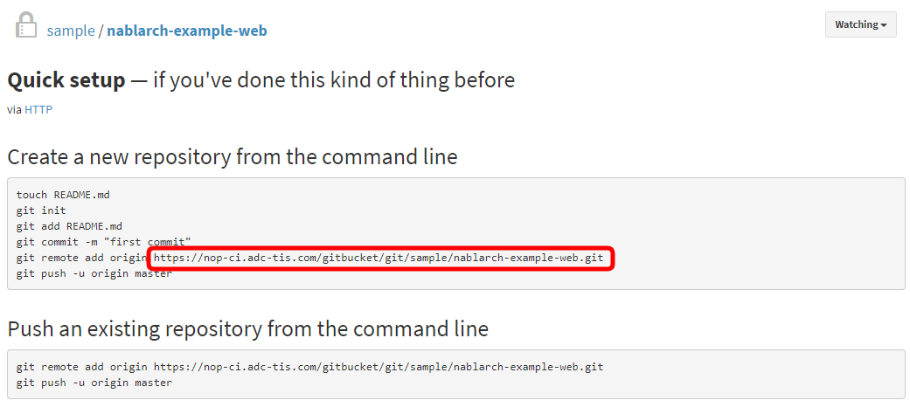
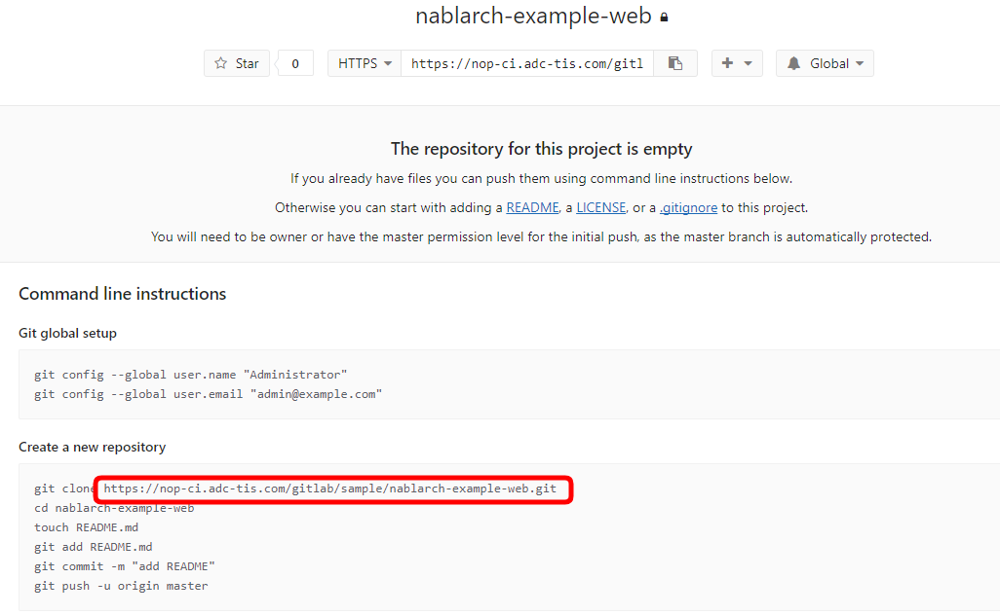

プロジェクトの開発準備
================================

ここでは、[nablarch-example-web](https://github.com/nablarch/nablarch-example-web)を使って、
開発準備を一通り説明しています。
プロジェクトの開発準備の参考にしてください。

- グループを追加します
  - [Redmineでのグループ追加](#redmineでのグループ追加)
  - [GitBucketでのグループ追加](#gitbucketでのグループ追加)
  - [GitLabでのグループ追加](#gitlabでのグループ追加)
- ユーザを追加します
  - [Redmineでのユーザ追加](#redmineでのユーザ追加)
  - [Rocket.Chatでのユーザ追加](#rocketchatでのユーザ追加)
  - [GitBucketでのユーザ追加](#gitbucketでのユーザ追加)
  - [GitLabでのユーザ追加](#gitlabでのユーザ追加)
- プロジェクト(またはリポジトリ)を追加します
  - [Redmineでのプロジェクト追加](#redmineでのプロジェクト追加)
  - [GitBucketでのリポジトリ追加](#gitbucketでのリポジトリ追加)
  - [GitLabでのリポジトリ追加](#gitlabでのリポジトリ追加)
- CIを追加します
  - [JenkinsでのCI追加](#jenkinsでのci追加)
  - [GitLabでのCI追加](#gitlabでのci追加)

## グループを追加します


### Redmineでのグループ追加

#### 管理者

- 管理者でログインします。
- 画面左上の「管理」＞「グループ」＞「新しいグループ」を選択します。
  - 名前: sample
- 作成します。


### GitBucketでのグループ追加

#### 管理者

- 管理者でログインします。
- 画面右上の「＋」アイコン＞「New group」を選択します。
  - Group name: sample
- Create groupします。


### GitLabでのグループ追加

#### 管理者

- 管理者でログインします。
- 画面右上の「＋」アイコン＞「New group」を選択します。
  - Group path: sample
  - Group name: sample
- Create groupします。

## ユーザを追加します

### Redmineでのユーザ追加

#### 管理者

- 管理者でログインします。
- 画面左上の「管理」＞「ユーザー」＞「新しいユーザー」を選択します。
  - 必須項目を入力します。
  - 次回ログイン時にパスワード変更を強制: ON
- 作成します。
- グループに追加します。
  - 「グループ」タブを選択します。
    - sampleをチェックし、保存します。

#### 開発メンバ

- 管理者が作成したユーザでログインします。


### Rocket.Chatでのユーザ追加


#### 管理者

- 管理者でログインします。
- 画面左上のプルダウン＞「管理」＞「ユーザー」＞画面右の「＋」アイコンを選択します。
  - 必須項目を入力します。
  - パスワードの変更を要求: ON
- 作成します。

#### 開発メンバ

- 管理者が作成したユーザでログインします。
- チャンネル「#jenkins」「#gitlab」に参加します。
  - 画面左の「その他のチャンネル...」を選択し、チャンネルを選択します。
    - 画面一番下の「参加」を選択します。


### GitBucketでのユーザ追加


#### 管理者

- 管理者でログインします。
- 画面右上のプルダウン(＋の右となり)＞「System Administration」＞「User management＞「New user」を選択します。
  - 必須項目を入力します。
  - Create userします。
- グループに追加します。
  - User managementの一覧からsampleの「Edit」を選択します。
    - 「Members」に作成したユーザを追加します。
    - Update groupします。

#### 開発メンバ

- 管理者が作成したユーザでログインします。


### GitLabでのユーザ追加


#### 管理者

- 管理者でログインします。
- 画面右上の「レンチ」(Admin area)アイコン＞「Overview」タブ＞「Users」タブ＞「New user」を選択します。
  - 必須項目を入力します。
- Create userします。
- 作成したユーザの「Edit」を選択し、パスワードを設定します。
    - Password/Password confirmationを指定します。
- Save changesします。
- グループに追加します。
  - 画面左上の「レンチ」(Admin area)アイコン＞「Overview」タブ＞「Groups」＞「sample」＞を選択します。
    - Add user(s) to the group の上段のテキストボックス: 作成したユーザ
    - Add user(s) to the group の下段のテキストボックス:: Guest->Maintainer
      - 開発ユーザはDeveloperでよいのですが、初回のmasterリポジトリへのpushを行うにはMaintainerの必要があります。
    - Add users to groupします。

#### 開発メンバ

- 管理者が作成したユーザでログインします。
  - 画面右上の「画像」＞「Sign out」を選択します。
  - ログインすると、パスワード変更が求められるので変更します。

## プロジェクト(またはリポジトリ)を追加します


### Redmineでのプロジェクト追加


#### 管理者

- 管理者でログインします。
- 画面左上の「プロジェクト」＞「新しいプロジェクト」を選択します。
  - 名前: nablarch-example-web
  - 識別子: nablarch-example-web
  - モジュール: BacklogsをONにします。
- 作成します。
- グループに追加します。
  - 画面左上の「管理」＞「グループ」＞「sample」＞「プロジェクト」タブ＞「プロジェクトの追加」を選択します。
    - プロジェクト: nablarch-example-web
    - ロール: Developer
    - 追加します。

#### 開発メンバ

- 管理者が作成したユーザでログインします。
  - 画面右上の「プロジェクトへ移動」プルダウンでnablarch-example-webに移動できます。


### GitBucketでのリポジトリ追加


#### 管理者

- 管理者でログインします。
- 画面右上の「＋」アイコン＞「New repository」を選択します。
  - Owner: sample
  - Repository name: nablarch-example-web
  - Private: ON
  - Initialize this repository with a README: OFF
    ※nablarch-example-web(既に存在するプロジェクト)を追加するのでREADME作成をOFFにしています。
      新しくリポジトリを作成する場合はREADME作成をONにして、git cloneから開発をスタートできます。
  - Create repositoryします。
- 作成したリポジトリにnablarch-example-webを追加します。
  - 作業PCの適当な場所で次のコマンドを実行します。
    ```
    $ git clone https://github.com/nablarch/nablarch-example-web.git
    $ cd nablarch-example-web/
    $ git remote rm origin
    $ git remote add origin <リポジトリのURL>
    $ git push -u origin master
    $ git checkout -b develop
    $ git push origin develop
    ```
    - <リポジトリのURL>は作成したリポジトリのページで確認します。
      - 
    - ユーザ/パスワードを聞かれるので、作成したユーザを指定します。

#### 開発メンバ

- 管理者が作成したユーザでGitBucketにログインします。
  - 画面左の「sample/nablarch-example-web」からnablarch-example-webに移動できます。


### GitLabでのリポジトリ追加


#### 管理者

- 管理者でログインします。
- 画面右上の「＋」アイコン＞「New project」を選択します。
  - Project path: sample
  - Project name: nablarch-example-web
- Create projectします。
- オレンジ色でSSHに関するメッセージが表示されるので、「Don't show again」を選択します。
- 作成したリポジトリにnablarch-example-webを追加します。
  - 作業PCの適当な場所で次のコマンドを実行します。
    ```
    $ git clone https://github.com/nablarch/nablarch-example-web.git
    $ cd nablarch-example-web/
    $ git remote rm origin
    $ git remote add origin <リポジトリのURL>
    $ git push -u origin master
    $ git checkout -b develop
    $ git push origin develop
    ```
    - <リポジトリのURL>は作成したリポジトリのページで確認します。
      - 
    - ユーザ/パスワードを聞かれるので、作成したユーザを指定します。

#### 開発メンバ

- 管理者が作成したユーザでGitLabにログインします。
  - 「sample/nablarch-example-web」からnablarch-example-webに移動できます。

## CIを追加します


### JenkinsでのCI追加


#### 管理者

- パイプラインを準備します。
  - 作業場所でパイプラインをnablarch-example-webにコピーします。
    - Java 8でビルドする場合
      ```
      $ cp -r pipeline/jenkins/java8/* <nablarch-example-webへのパス>
      ```
    - Java 11でビルドする場合
      ```
      $ cp -r pipeline/jenkins/java11/* <nablarch-example-webへのパス>
      ```
  - いくつか設定ファイルを変更していくので、IDEでnablarch-example-web(Mavenプロジェクト)を開きます。
  - パイプラインのパラメータを変更します。
    ```
    nablarch-example-web/Jenkinsfile
    ```
    - 環境変数を修正します。
      ```
      environment {
        SONAR_HOST_URL = '<SonarQubeのURL>'
        DEMO_HOST = '<Demoサーバのホスト>'
        DEMO_PORT = '<DemoサーバのSSHのポート番号>'
        DEMO_USERNAME = '<DemoサーバのSSHのユーザ名>'
        DEMO_PASSWORD = '<DemoサーバのSSHのパスワード>'
      }
      ```
    - [URLの仕組み](url.md)を参照し、環境に合わせて適切なURL指定を行ってください。
    - こんな感じになります。
      ```
      environment {
        SONAR_HOST_URL = 'http://10.0.1.110/sonarqube'
        DEMO_HOST = '10.0.1.63'
        DEMO_PORT = '22'
        DEMO_USERNAME = 'centos'
        DEMO_PASSWORD = 'pass789-'
      }
      ```
  - Executable Jarでデプロイするため、waitt-maven-pluginの設定を変更します。
    ```
    nablarch-example-web/pom.xml
    ```
    - waitt-maven-plugin/waitt-tomcat8のバージョン番号を1.2.1に変更します。1.2.1以上であれば変更しなくても大丈夫です。
      ```
      <plugin>
        <groupId>net.unit8.waitt</groupId>
        <artifactId>waitt-maven-plugin</artifactId>
        <version>1.2.1</version>
        <configuration>
          <servers>
            <server>
              <groupId>net.unit8.waitt.server</groupId>
              <artifactId>waitt-tomcat8</artifactId>
              <version>1.2.1</version>
            </server>
          </servers>
        </configuration>
      </plugin>
      ```
  - pushします。
- Java 11でビルドする場合は、JenkinsにJDKを追加します。
  - Jenkinsに管理者でログインします。
  - 「Jenkinsの管理」＞「Global Tool Configuration」を選択します。
  - 「JDK追加」をクリックします。入力欄が表示されます。
  - 「インストーラーの削除」をクリックし、「インストーラーの追加」プルダウン＞「*.zip/*.tar.gz展開」を選択します。
  - 各項目を入力します。
    - 名前: JDK11
    - 自動インストール: on
    - *.zip/*.tar.gz展開
      - ラベル: 空欄
      - アーカイブダウンロードURL: `https://qiita.com/boushi-bird@github/items/49627b6a355ea2dfa57a#インストールするjdkを設定する` を参考に入力します。  
        以下に例を示します。
        ```
        https://download.java.net/java/GA/jdk11/9/GPL/openjdk-11.0.2_linux-x64_bin.tar.gz
        ```
      - アーカイブを展開するサブディレクトリ: ユニークなディレクトリを指定します。  
        以下に例を示します。
        ```
        jdk-11.0.2
        ```
- Jenkinsにジョブを作成します。
  - Jenkinsに管理者でログインします。
  - Multibranch Pipelineを作成します。
    - Multibranch Pipelineにより、リポジトリのブランチを自動検知して、ジョブを自動で追加してくれます。
    - 「新しいジョブを作成してください。」を選択します。
    - Enter an item name: nablarch-example-web
    - 「Multibranch Pipeline」を選択します。
    - OKします。
  - 作成したジョブの設定を行います。
    - Branch Sources
      - 「Add source」プルダウン＞「Git」を選択します。
        - プロジェクトリポジトリ: リポジトリのURLを指定します。
          - [URLの仕組み](url.md)を参照し、環境に合わせて適切なURL指定を行ってください。
          - 例: http://proxy/gitbucket/git/sample/nablarch-example-web.git
        - 認証情報:
          - 「追加」プルダウン＞「Jenkins」を選択します。
            - GitBucketで作成したユーザのユーザ名とパスワードを指定します。
            - 追加します。
          - 追加した認証情報を選択します。
    - Scan Multibranch Pipeline Triggers
      - 他のビルドが起動していなければ定期的に起動: ON
        - 間隔: 5minute
    - 保存します。
  - Jenkinsがブランチを検知してジョブが実行されます。
    - 初回は大量の依存モジュールを落としてくるため、少し時間（5分～10分ぐらい）がかかります。
    - 「Deploy to demo」まで成功すると、デプロイされたアプリにアクセスできます。ブラウザでアクセスします。
      ```
      <DEMOサーバのホスト>/
      ```
      - ログインID: 10000001
      - パスワード: pass123-

### GitLabでのCI追加


#### 管理者

- ビルド結果の通知設定を行います。
  - 管理者でログインします。
  - 画面左上の「Gitlab」(アイコン)＞「sample/nablarch-example-web」を選択します
  - 「Setting」＞「Integrations」を選択します
    - URL: Rocket.ChatのWebhook URLのプロトコルをHTTPに、ホスト名をCQサーバのURLにしたもの。以下に例を示します。
      ```
      http://10.0.1.75/rocketchat/hooks/Pf9RdMSfer4xWGNvb/emn2DcnHcGyyzct9fiu8FWY6JWyxo4BQG6MCZo4xr6rKHjNP
      ```
    - Pipeline events: ON

- パイプラインを準備します。
  - 作業場所でパイプラインをnablarch-example-webにコピーします。
    - Java 8でビルドする場合
      ```
      $ cp -r pipeline/gitlab/java8/* <nablarch-example-webへのパス>
      ```
    - Java 11でビルドする場合
      ```
      $ cp -r pipeline/gitlab/java11/* <nablarch-example-webへのパス>
      ```
  - いくつか設定ファイルを変更していくので、IDEでnablarch-example-web(Mavenプロジェクト)を開きます。
  - パイプラインのパラメータを変更します。
    ```
    nablarch-example-web/.gitlab-ci.yml
    ```
    - 環境変数を修正します。
      ```
      variables:
        SONAR_HOST_URL: <SonarQubeのURL>
        DEMO_HOST: <Demoサーバのホスト>
        DEMO_PORT: <DemoサーバのSSHのポート番号>
        DEMO_USERNAME: <DemoサーバのSSHのユーザ名>
        DEMO_PASSWORD: <DemoサーバのSSHのパスワード>
      ```
    - [URLの仕組み](url.md)を参照し、環境に合わせて適切なURL指定を行ってください。
    - こんな感じになります。
      ```
      variables:
        SONAR_HOST_URL: 10.0.1.75
        DEMO_HOST: 10.0.1.164
        DEMO_PORT: 22
        DEMO_USERNAME: centos
        DEMO_PASSWORD: pass789-
      ```
  - パイプラインのパラメータを変更します。
    ```
    nablarch-example-web/ci/settings.xml
    ```
    - MavenリポジトリのURLを修正します。
      ```
      <url>http://<CIサーバ>/nexus/repository/maven-public/</url>
      ```
    - [URLの仕組み](url.md)を参照し、環境に合わせて適切なURL指定を行ってください。
    - こんな感じになります。
      ```
      <url>http://10.0.1.9/nexus/repository/maven-public/</url>
      ```
  - Executable Jarでデプロイするため、waitt-maven-pluginの設定を変更します。
    ```
    nablarch-example-web/pom.xml
    ```
    - waitt-maven-plugin/waitt-tomcat8のバージョン番号を1.2.1に変更します。1.2.1以上であれば変更しなくても大丈夫です。
      ```
      <plugin>
        <groupId>net.unit8.waitt</groupId>
        <artifactId>waitt-maven-plugin</artifactId>
        <version>1.2.1</version>
        <configuration>
          <servers>
            <server>
              <groupId>net.unit8.waitt.server</groupId>
              <artifactId>waitt-tomcat8</artifactId>
              <version>1.2.1</version>
            </server>
          </servers>
        </configuration>
      </plugin>
      ```
  - Java11でビルドする場合は以下を参考に、pom.xmlとunit-test.xmlを修正します。  
    https://nablarch.github.io/docs/LATEST/doc/application_framework/application_framework/blank_project/setup_blankProject/setup_Java11.html
  - pushします。
  - GitLabが変更を検知し、ビルドが実行されます。

これで開発準備は終わりです！
お疲れさまでしたー
