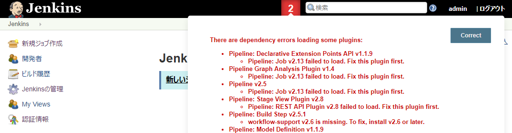
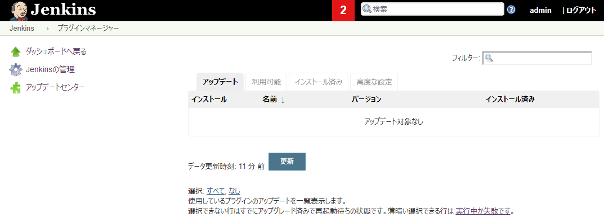

アプリの初期設定
================================

ここでは、チーム開発環境をスムーズに使い始めるために、最低限の初期設定を行います。
ここに記載していない設定項目はプロジェクトで自由にカスタマイズしてください。

- [Redmine](#redmine)
- [Rocket.Chat](#rocketchat)
- [SonarQube](#sonarqube)
- [Nexus](#nexus)
- [Subversion](#subversion)
- [GitBucket](#gitbucket)
- [Jenkins](#jenkins)
- [GitLab](#gitlab)
- [Concourse](#concourse)


## Redmine


- ブラウザでアクセスします。
  ```
  <CQサーバのホスト>/redmine
  ```
- ブラウザでアクセスしたURLをブックマークしておきます。
- ログインします。
  - 画面右上の「ログイン」を選択します。
    - ログインID: admin
    - パスワード: admin
  - パスワード変更が求められるので、パスワードを変更します。
- かんばん用のトラッカー(StoryとTask)を追加します。
  - 画面左上の「管理」＞「トラッカー」＞「新しいトラッカーを作成」を選択します。
    - 名前: Story
    - デフォルトのステータス: New
    - ワークフローをここからコピー: 空欄のまま
  - 「このトラッカーにワークフローが定義されていません(編集)」を選択します。
    - ロール: すべて
    - 「編集」を選択します。
      - New/In Progress/Closedの組み合わせを全部チェックします。
      - 保存します。
  - 画面右の「トラッカー」＞「新しいトラッカーを作成」を選択します。
    - 名前: Task
    - デフォルトのステータス: New
    - ワークフローをここからコピー: Story
- かんばんの設定をします。
  - 画面右の「プラグイン」＞Redmine Backlogsの「設定」を選択します。
    - ストーリーに利用するトラッカー: Story
    - デフォルトのストーリートラッカー: Story
    - タスクとして利用のトラッカー: Task
    - 適用します。
- ロールと権限の設定をします。
  - 画面右の「ロールと権限」＞「Manager」を選択します。
    - 権限＞Backlogsを全部チェックします。
    - 保存します。
  - Developerも同様に設定します。
- ユーザによるアカウント登録を無効にします。
  - 画面左上の「管理」＞「設定」＞「認証」タブを選択します。
    - ユーザによるアカウント登録: 無効
    - 保存します。


## Rocket.Chat


- ブラウザでアクセスします。
  ```
  <CQサーバのホスト>/rocketchat
  ```
- ブラウザでアクセスしたURLをブックマークしておきます。
- 管理者を登録します。
  - 「新しいアカウントを登録」を選択します。
  - 1人目のアカウントが管理者になります。
  - 名前、メアド、パスワードを入力します。
  - サイトURL設定に関するWarningが表示されるので「はい」を選択します。
  - ユーザ名を登録します。
- 登録フォームを無効にします。
  - 画面左上のプルダウン＞「管理」＞画面左の下の方にある「アカウント」＞画面下にあるRegistrationの「EXPAND」を選択します。
    - 登録フォームへのアクセス: 無効
    - 変更を保存します。
- CI結果をチャットに通知するための設定を行います。
  - Jenkinsを使う場合
    - Jenkins用のユーザを追加します。
      - ユーザの追加方法は[ここ](dev.md#add-user-rocketchat)を見てください。
        - 名前/ユーザ名: jenkins
        - パスワードの変更を要求: チェックを外します。
        - ロール: bot
        - デフォルトのチャンネルに参加: チェックを外します。
        - ウェルカムメールを送信: チェックを外します。
        - 保存します。
    - Jenkins用のチャンネルを追加します。
      - 画面左上の「＋」アイコンを選択します。
        - 名前: jenkins
        - ユーザを選択:
          - jenkins
        - 作ります。
  - Concourseを使う場合
    - Concourse用のチャンネルを作成します。
      - 画面左上の「＋」アイコンを選択します。
        - 名前: concourse
        - ユーザを選択: 
          - rocket.chat
        - 作ります。
    - Concourseから通知を受け取るWebHook URLを作成します。
      - 画面左上のプルダウン＞「管理」＞「サービス連携」＞「新しいサービス連携」＞「Incoming WebHook」を選択します。
        - 有効: はい
        - 名前 (オプション): concourse
        - 投稿先チャンネル: #concourse
        - 画面の一番下まで移動して、変更を保存します。
        - 変更を保存すると「Webhook URL」「Token」が出現します。
        - 「Webhook URL」の「クリップボードへコピー」を選択して、URLをコピーします。後ほどパイプラインに設定します。


## SonarQube


- ブラウザでアクセスします。
  ```
  <CQサーバのホスト>/sonarqube
  ```
- ブラウザでアクセスしたURLをブックマークしておきます。
- ログインします。
  - 画面右上の「Log in」を選択します。
    - Login: admin
    - Password: admin
- パスワードを変更します。
  - 画面右上の「Administrator」＞「My Account」＞「Security」タブを選択します。
    - 画面右のChange passwordエリアからパスワードを変更します。
- プラグインをインストールします。
  - 画面左上の「Administration」＞「System」タブのプルダウン＞「Update Center」を選択します。
    - 「Available」を選択します。
    - 「Search」エリアに「java」と入力して検索し、「SonarJava」の「Install」を選択します。
    - 「Search」エリアに「git」と入力して検索し、「Git」の「Install」を選択します。
    - GitLabを使用する場合は、「Search」エリアに「gitlab」と入力して検索し、「GitLab」の「Install」を選択します。
    - 再起動を促すメッセージが表示されるので、「Restart」を選択します。
    - 再起動後、「Installed」を選択すると、インストールされたプラグインを確認できます。


## Subversion


- SSHでアクセスします。
  ```
    $ ssh -F .ssh/ssh.config nop-cq
  ```
- ユーザを作成します。
  - ID: root
  - パスワード: pass123-
  ```
    $ docker exec -t subversion htpasswd -bc /etc/apache2/conf.d/davsvn.htpasswd root pass123-
  ```


## Nexus


- ブラウザでアクセスします。
  ```
  <CIサーバのホスト>/nexus
  ```
- ブラウザでアクセスしたURLをブックマークしておきます。
- ログインします。
  - 画面右上の「Sign in」を選択します。
    - ログインID: admin
    - パスワード: admin123
- パスワードを変更します。
  - 画面右上の「admin」を選択します。
  - 「Change password」ボタンを選択します。
  - パスワードを変更します。
  - ログアウトして、変更したパスワードで入りなおします。
    - 画面右上の「Sign out」を選択します。
- プロキシ環境下の場合はプロキシを設定します。
  - 画面左上の「歯車(Server administration and configuration)」アイコン＞画面左のSystemの「HTTP」を選択します。
    - HTTP proxy: チェックしてプロキシを設定します。
    - HTTPS proxy: チェックしてプロキシを設定します。
    - プロキシ情報はネットワーク管理者に確認してください。
    - Saveします。
- Maven/Dockerリポジトリを追加します。
  - 画面左上の「歯車(Server administration and configuration)」アイコン＞「Repositorites」＞「CreateRepository」を選択します。
    - nablarch-example-webで必要となる3つのリポジトリを作成します。
      - seasar
        - Recipe: maven2(proxy)
        - Name: seasar
        - Proxy > Remote storage: http://maven.seasar.org/maven2
      - clojars
        - Recipe: maven2(proxy)
        - Name: clojars
        - Proxy > Remote storage: https://clojars.org/repo
      - sonatype
        - Recipe: maven2(proxy)
        - Name: sonatype
        - Proxy > Remote storage: https://oss.sonatype.org/content/repositories/snapshots/
    - 追加したリポジトリをmaven-publicグループに追加します。
      - リポジトリ一覧から「maven-public」を選択します
      - Group > Member Repositories > Members: 追加したリポジトリを指定します。
      - Saveします。
    - Concourseを使用する場合は、リポジトリ一覧に戻ってDocker Hubと公開用のグループを作成します。
      - docker-hub
        - Recipe: docker(proxy)
        - Name: docker-hub
        - Proxy > Remote storage: https://registry-1.docker.io
      - docker-public(グループ)
        - Recipe: docker(group)
        - Name: docker-public
        - Repository Connectors > HTTPS: 18444
        - Group > Member repositories > Members: docker-hub


## GitBucket


- ブラウザでアクセスします。
  ```
  <CIサーバのホスト>/gitbucket
  ```
- ブラウザでアクセスしたURLをブックマークしておきます。
- ログインします。
  - 画面右上の「Sign in」を選択します。
    - Username: root
    - Password: root
- パスワードを変更します。
  - 画面右上のプルダウン(＋の右となり)＞「Account Settings」
    - Password (input to change password): 新しいパスワード
    - Saveします。
  - ログアウトして、変更したパスワードで入りなおします。
    - 画面右上のプルダウン(＋の右となり)＞「Sign out」
- Base URLを設定します。
  - 画面右上のプルダウン(＋の右となり)＞「System Administration」＞「System Settings」を選択します。
    - Base URL (e.g. http://example.com/gitbucket): ブラウザでアクセスしたURLを指定します。
    - Apply changesします。


## Jenkins


- ブラウザでアクセスします
  ```
  <CIサーバのホスト>/jenkins
  ```
- ブラウザでアクセスしたURLをブックマークしておきます。
- ロックを解除します
  - パスワードを取得します
    - 作業場所で以下のコマンドを実行し、パスワードを取得します。
      ```
      $ ssh -F .ssh/ssh.config nop-ci "cd nop/docker/ci; ./jenkins-password.sh"
      <ここにパスワードが出力さます>
      Killed by signal 1.
      Killed by signal 1.
      $ 
      ```
  - Administrator password: 取得したパスワードを貼り付けます。 
- オフラインの場合は「Configure Proxy」を選択します。
  - サーバーからパスワードまで入力します。
    - プロキシ情報はネットワーク管理者に確認してください。
  - 対象外ホスト: Jenkinsからアクセスする可能性がある「proxy(docker-composeのサービス名)」と「CQサーバのプライベートIP」をカンマ区切りで指定します。
    - 例: proxy,10.0.1.110
    - 指定内容は[URLの仕組み](url.md)を参照してください。
- プラグインをインストールします。
  - 「Install suggested plugins」を選択します。
  - インストールが終わるまで待ちます。
  - 失敗したら、全部入るまで「Retry」を続けます。
- 管理者を登録します。
  - 全部の項目を入力します。
  - Save and Finishします。
- Jenkinsをスタートします。
- 画面上部に赤い数字が表示された場合は確認します。
  - 画面上部の「赤い数字」を選択します。プラグインのロードエラーが出た場合は解消します。新しいバージョンの話しであれば無視します。
    - 
  - プラグインのロードエラーを解消します。
    - 「赤い数字」＞「Correct」を選択します。
    - 画面左の「アップデートセンター」を選択します。
      - 
    - 画面一番下の「インストール完了後、ジョブがなければJenkinsを再起動する」をチェックします。
    - Jenkinsの再起動を待ちます。
    - ログインします。
    - プラグインのロードエラーが出ていなければ問題解消です。
- Mavenを設定します。
  - ロゴを選択してトップページを表示します。
  - 画面左の「Jenkinsの管理」＞「Global Tool Configuration」を選択します。
  - 画面の下の方にあるMavenを設定します。
    - 「Maven追加」を選択します。
      - 名前: mvn3
    - Saveします。
- RocketChat Notifierプラグインを入れます。
  - ロゴを選択してトップページに移動します。
  - 画面左の「Jenkinsの管理」＞「プラグインの管理」＞「利用可能」タブを選択します。
  - 画面右のフィルターに「rocket]と入力するなどして、「RocketChat Notifier」を選択します。
  - 「再起動せずにインストール」を選択します。
  - しばらくすると「成功」が表示されます。
- CI結果をチャットに通知するための設定を行います。
  - ロゴを選択してトップページに移動します。
  - 画面左の「Jenkinsの管理」＞「システムの設定」を選択します。
  - 画面一番下のGlobal RocketChat Notifier Settingsを指定します。
    - Rocket Server URL: Rocket.ChatのURLを指定します。
      - [URLの仕組み](url.md)を参照し、環境に合わせて適切なURL指定を行ってください。
      - 例: http://10.0.1.110/rocketchat/
    - Login Username/Login password/Channel: 先ほど作成したユーザ/チャンネルを指定します。
    - Build Server URL: JenkinsのURLを指定します。
      - こちらはブラウザでアクセスする場合と同じURLを指定します。
      - 例: https://nop-ci.adc-tis.com/jenkins
    - Test Connectionします。Successと表示されればOKです。Rocket.Chatのチャンネルにメッセージが届いています。
      - メッセージのリンクをクリックしてJenkinsへ移動できることを確認します。
  - 保存します。
- ログインせずにCI結果を見れるようにします。
  - ロゴを選択してトップページに移動します。
  - 画面左の「Jenkinsの管理」＞「グローバルセキュリティの設定」を選択します。
    - アクセス制御＞権限管理＞ログイン済みユーザーに許可＞Allow anonymous read accessをチェックします。
    - 保存します。


## GitLab


- ブラウザでアクセスします。
  ```
  <CIサーバのホスト>/gitlab
  ```
- ブラウザでアクセスしたURLをブックマークしておきます。
- パスワードを変更します。
- ログインします。
  - Username or email: root
  - Password: 変更したパスワード
- サインインページのユーザ登録(Register)を無効化します。
  - 画面右上の「レンチ(Admin area)」アイコン)＞画面右上のユーザ画像の下にある「歯車」アイコン＞「Settings」を選択します
      - Sign-up Restrictions＞Sign-up enabled: OFF
      - Saveします。
- ログアウトして、ユーザ登録(Register)が表示されないことを確認します。
  - 画面右上のユーザ画像＞「Sign out」


## Concourse


- ブラウザでアクセスします。
  ```
  <CIサーバのホスト>/    ※Concourseはベースパスに対応していないため、URLはパス指定なしです。
  ```
- ブラウザでアクセスしたURLをブックマークしておきます。
- ログインします。
  - 画面右上の「login」を選択します。
    - 「main」を選択します
      - username/password: docker-composeの定義ファイルに指定したものを指定します。
      - 画面右上にmainと表示されればログイン成功です。

これで初期設定は終わりです。
少し休憩したら、[開発準備](dev.md)へ進みましょう。
