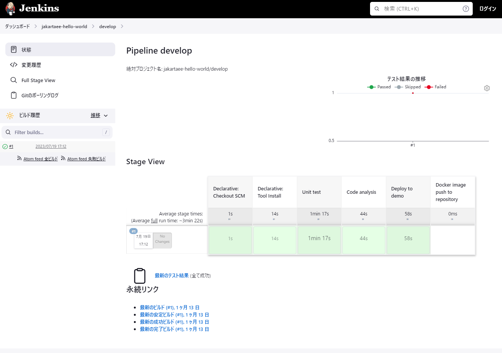
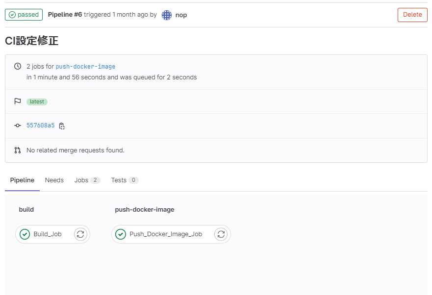

パイプライン
================================================================

ここでは、Collaborageが提供するパイプラインの内容を簡単に説明します。

- [Jenkins](#jenkins)
- [GitLab Runner](#gitlab-runner)

# Jenkins

- 「ユニットテスト」＞「コード解析」＞「デモ環境へのデプロイ」を順に行います。
- 「ユニットテスト」は「mvn -P gsp generate-resources」「mvn test」を実行しレポート出力します。
- 「コード解析」は「mvn sonar:sonar」を実行し、SonarQubeにコード解析結果を連携します。
- 「デモ環境へのデプロイ」はdevelopブランチのみ行います。develop以外のブランチはデプロイしません。
- 「デモ環境へのデプロイ」は次の処理で行っています。
  - 「mvn -P gsp generate-resources」「mvn waitt:jar」を実行して、初期データとExecutable Jarを作成します。
  - 初期データとExecutable Jar、Dockerfile、アプリ起動スクリプトをsshpassを使ってデモサーバに送信し、アプリ起動スクリプトを実行します。

# GitLab Runner

- 「ユニットテスト及びコード解析」＞「デモ環境へのデプロイ」を順に行います。  
  Jenkinsの場合と異なり、ユニットテストとコード解析をまとめています。  
  ユニットテスト時のビルド結果をコード解析でも使用したいのですが、GitLab RunnerはStageごとにコンテナを作り直すためビルド結果がstage間で連携されないためです。
- 「ユニットテスト及びコード解析」は「mvn -P gsp generate-resources」「mvn test」「mvn sonar:sonar」を実行し、SonarQubeにコード解析結果を連携します。  
  GitLab Runnerには、Jenkinsのようなレポート出力がないので、実行ログでテストNGを確認します。
- 「デモ環境へのデプロイ」はdevelopブランチのみ行います。develop以外のブランチはデプロイしません。
- 「デモ環境へのデプロイ」はJenkinsの場合と同じ方法でデモサーバにデプロイします。

